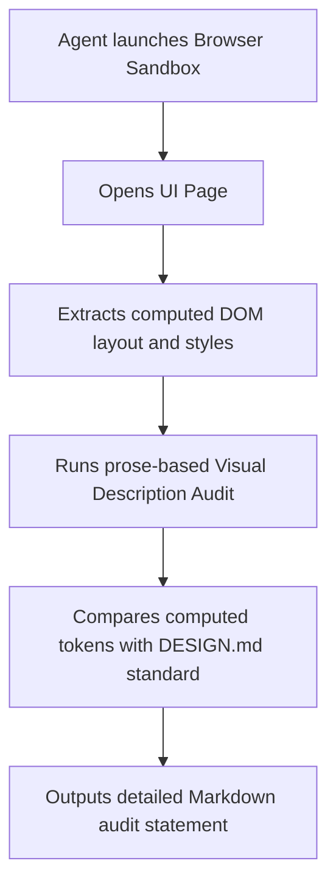

# FrameCode VibeWork UI/UX Design System & Verification Guidelines

---

This document establishes the official visual identity, component tokens, and user experience standards for the application. Furthermore, it defines a **pure-markdown verification standard** to calibrate and audit layout structures without relying on physical binary mockup folders, keeping the framework 100% portable and document-driven.

## 1. Visual Tone & Principles
The default visual identity of VibeWork-derived applications is **Premium Minimalist Dark Mode** with high visual depth, fluid micro-animations, and balanced information density (glassmorphism/sleek surfaces).

* **Visual Depth (Elevation)**: Use layered semi-transparent surfaces with soft shadows to build a clear information hierarchy.
* **Micro-Animations**: All interactive elements must react instantly but smoothly (hover, active transitions).
* **Keyboard-First Accessibility**: Every key action must have tooltips and clear visual keyboard focus indicators.
* **Platform Sizing Resilience**: Layouts must dynamically flow and remain fully usable under three target viewport window tests:
  1. **Standard Desktop**: `1920x1080` (maximized, spacious).
  2. **Compact Desktop / Tablet**: `1024x768` (dense list layouts).
  3. **Minimum Supported Size**: `800x600` (focus on main actions, sidebars collapsed or compact).

---

## 2. Core Design System Tokens

### 2.1. Harmonious HSL Color Palette
To prevent generic plain colors, VibeWork projects strictly enforce a curated dark palette based on HSL tailored colors.

| Token | HSL Value | Hex Equivalent | Usage |
| :--- | :--- | :--- | :--- |
| `--bg-main` | `hsl(222, 19%, 8%)` | `#0b0e14` | Deep canvas base background. |
| `--surface-panel` | `hsl(222, 15%, 12%)` | `#1a1d24` | Sidebar and elevated container panels. |
| `--card-glass` | `hsla(222, 15%, 15%, 0.7)` | `#20232b (70%)` | Semi-transparent card components. |
| `--border-subtle` | `hsla(222, 10%, 25%, 0.4)` | `#3a3c42 (40%)` | Discrete borders and separating rules. |
| `--text-primary` | `hsl(210, 15%, 85%)` | `#d1d5db` | High-contrast body text and titles. |
| `--text-muted` | `hsl(215, 10%, 60%)` | `#9ca3af` | Secondary labels, descriptions, and metadata. |
| `--brand-accent` | `hsl(260, 85%, 65%)` | `#8b5cf6` | Sleek violet accents, primary action hovers. |
| `--color-success` | `hsl(142, 70%, 45%)` | `#10b981` | Positive feedback, completions, validated states. |
| `--color-error` | `hsl(350, 75%, 50%)` | `#ef4444` | Warnings, deleted tags, destructive actions. |

### 2.2. Typographical Hierarchy
Ensure google fonts like **Inter** or **Outfit** are loaded for premium interfaces.
* **Main Title (H1)**: `24px / 32px line-height`, semibold, primary text color.
* **Section Title (H2)**: `18px / 24px line-height`, medium, accent borders.
* **Component Labels (H3)**: `14px / 20px line-height`, regular.
* **Body / Prose**: `14px / 22px line-height`, regular, secondary text.
* **Technical Code / Logs**: `13px`, monospaced font family (e.g., Fira Code, JetBrains Mono).

### 2.3. Spatial Layout and Margins
* **Base Grid Unit**: `4px`
* **Card Border Radius**: `8px` for primary elements, `6px` for small sub-components.
* **Container Padding**: `16px` inner padding.
* **Clickable Area target**: Minimum `36px` width/height for buttons to ensure touch and cursor click ease.

---

## 3. Pure-Markdown Visual Calibration Methodology (VCM)

In order to eliminate environment dependencies and folder clutter associated with binary screenshot mockups, the framework establishes the **Visual Calibration Methodology (VCM)** in pure prose.

When validating visual interfaces, the AI agent must perform a **Visual Description Audit (VDA)** by following this step-by-step descriptive checklist:



### 3.1. Visual Description Audit (VDA) Specification
Instead of visual image diffing, the agent creates a descriptive markdown audit log of the target layout. The VDA must objectively verify the following structural aspects:

1. **Alignment and Box Model**:
   * Inspect container outer margins. Confirm they match the spatial layout padding (e.g., `16px` padding, stable grid multipliers).
   * Verify that no elements overlap or push others outside the parent boundary box.
2. **Computed Style Check**:
   * Query the computed styles of container panels. Verify that backgrounds match the `--surface-panel` HSL token exactly.
   * Check scrollbar containers. Verify that custom scrollbar background matches its container background, with a discrete lighter thumb.
3. **Contrast Ratio compliance**:
   * Verify text color classes. Primary body must be `--text-primary` and helper text must be `--text-muted` to guarantee accessibility contrast.
4. **Behavior under Viewport Resize**:
   * Describe how the layout responds when the viewport is resized to `1024x768` and `800x600`.
   * Confirm that navigation toolbars collapse cleanly or slide into a hamburger menu, and main buttons remain fully accessible without overflow.

---

## 4. UI Component Standards

### 4.1. The Glassmorphism Card (`--card-glass`)
To keep surfaces feeling premium and state-of-the-art:
* **CSS Properties**:
  ```css
  background: var(--card-glass);
  backdrop-filter: blur(12px);
  border: 1px solid var(--border-subtle);
  border-radius: 8px;
  box-shadow: 0 4px 30px rgba(0, 0, 0, 0.2);
  ```

### 4.2. Custom Scrollbar Integration
Native scrollbars dilute a premium dark interface. Enforce this custom standard on all scrollable components:
```css
.scroll-container::-webkit-scrollbar {
  width: 6px;
  height: 6px;
}
.scroll-container::-webkit-scrollbar-track {
  background: transparent; /* Seamless match with container background */
}
.scroll-container::-webkit-scrollbar-thumb {
  background: var(--border-subtle);
  border-radius: 3px;
}
.scroll-container::-webkit-scrollbar-thumb:hover {
  background: var(--text-muted);
}
```

### 4.3. Native Modals & Overlay Layers
* Modals must never be standard browser alerts or system boxes.
* The backdrop overlay must use `hsla(222, 19%, 8%, 0.65)` with a backdrop blur of `4px` to visually separate background elements.
* Trapped keyboard focus inside modal containers is mandatory.

---

## 5. Visual Review & Verification Checklist
Before declaring a UI task as completed, the agent must execute and document this visual validation list inside the change plan:

- [ ] **Descriptive Audit**: Has a Visual Description Audit (VDA) been run and logged?
- [ ] **Contrast Check**: Do all foreground texts have excellent contrast ratios against HSL backgrounds?
- [ ] **No Overlap**: Are long texts handled dynamically via ellipsis or scroll without colliding?
- [ ] **Responsive Test**: Was the component verified at `1920x1080`, `1024x768`, and `800x600`?
- [ ] **Custom Scrollbars**: Are native browser scrollbars styled cleanly using custom track and thumb tokens?
- [ ] **Interactive Tooltips**: Do all icon-only or non-obvious controls have tooltips?
