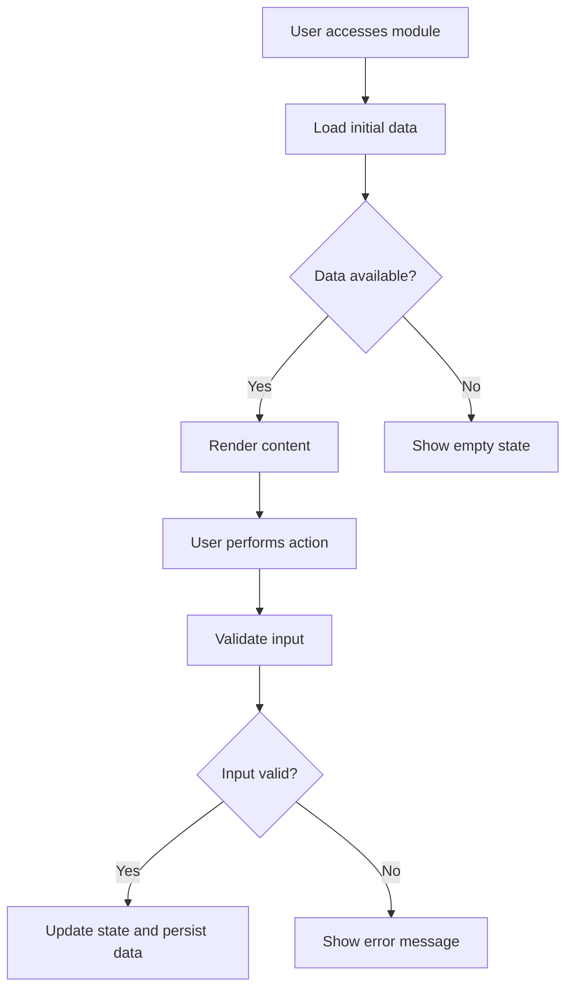

# Application Module Documentation

This document defines how downstream applications using FrameCode VibeWork should document pages, screens, modules, components, and flows.

The framework defines the standard. The generated application documentation belongs to the application.

## Objective

Ensure that application modules are documented consistently, with traceability between implementation, business rules, dependencies, states, validations, risks, and visual flow references.

## Physical Ownership

The application documentation path is:

```text
[project-root]/docs/
```

Rules:

- `docs/` at the project root is application-owned in an instantiated or downstream application.
- `docs/` must not be versioned as a framework-owned documentation site artifact in the FCVW baseline.
- `FCVW/` stores the rules and reusable templates.
- Filled module documents must not be stored inside `FCVW/` unless they document the framework itself.
- If the baseline framework repository needs a public site, publish it from another repository or external pipeline, not from this application-documentation convention.

## Recommended Structure

Create this structure in the downstream application when module documentation becomes relevant:

```text
[project-root]/
|-- FCVW/
\-- docs/
    |-- README.md
    |-- modules/
    |   |-- TEMPLATE_MODULE.md
    |   |-- <module-name>.md
    |   \-- ...
    \-- flows/
        |-- TEMPLATE_FLOW.md
        |-- <flow-name>.md
        \-- ...
```

Use the framework templates as source:

- `FCVW/governance/TEMPLATE_APP_DOCS_README.md`
- `FCVW/governance/TEMPLATE_MODULE_DOCUMENTATION.md`
- `FCVW/governance/TEMPLATE_FLOW_DOCUMENTATION.md`

## When Documentation Is Required

Update or create application module documentation when a change affects:

- page or screen behavior;
- module responsibilities;
- user actions or events;
- business rules;
- data inputs or outputs;
- internal or external dependencies;
- states, empty states, error states, or success states;
- validation rules;
- relevant risks;
- navigation or cross-module flows.

Documentation is not required for trivial internal edits that do not affect observable module behavior, but the plan must explicitly state why it is not applicable.

## Minimum Module Document Scope

Each relevant module document must include:

- module name;
- objective;
- related pages, files, components, or services;
- expected inputs;
- produced outputs;
- applicable business rules;
- internal dependencies;
- external dependencies;
- user events and actions;
- possible states;
- validation criteria;
- known risks;
- Mermaid flowchart or dependency diagram;
- relevant change history.

## Mermaid Guidance

Use Mermaid to describe flows, dependencies, and interactions when visual reasoning improves maintainability.

Example:



## Plan Relationship

Plans that alter application modules must state one of:

- module documentation updated;
- module documentation created;
- module documentation not applicable, with justification.

The validation evidence must include the relevant documentation path or the explicit non-applicability reason.

## Relationship with application rules

When a module document describes a durable cross-module or domain constraint, link the corresponding `APP-RULE-NNN` entry in [`APP_RULES.md`](APP_RULES.md). Module documentation explains the local flow; `APP_RULES.md` owns the cross-cutting application rule.

A relevant change records one of: rule unchanged after consultation, rule updated, rule added, or no matching application rule. Plain repeated prose in several module documents is not a substitute for a canonical application rule.
