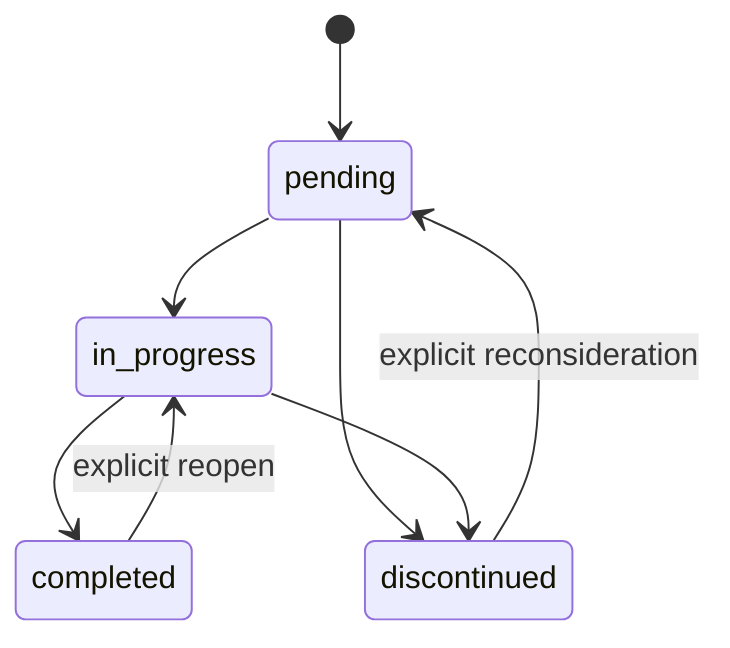

# Change planning

## Purpose

Create one reviewable contract for a logical change batch before implementation. A plan controls scope; it is not a diary of every command.

## When planning applies

Read-only work does not create a plan. A versioned change uses one of these forms:

| Class | Typical use | Required detail |
|---|---|---|
| Compact | isolated P4/P5-R1 text or metadata | objective, files, validation, rollback, status |
| Standard | functional, visual, structural, configuration, tests, docs behavior | full plan template |
| Expanded | R4/R5, security, migration, destructive work, schema or framework release | full template, gates, approval, rollback rehearsal |

The plan covers its own creation and related changelog. Group files that form one atomic outcome; do not manufacture one plan per file.

## Lifecycle

Allowed statuses are `pending`, `in_progress`, `completed`, and `discontinued`. The status field must match the directory.

## Required data

- schema and unique ID;
- description, objective, justification, and scope;
- affected files or boundaries;
- priority, risk, owner, dates, current and expected versions;
- implementation steps;
- acceptance criteria;
- validation plan and executed evidence;
- Regression impact: protected behaviors, consulted contracts, selected checks, results, limitations, and residual risk;
- rollback or explicit non-applicability;
- related plans, decisions, failures, and changelog;
- status.

Use `governance/TEMPLATE_PLAN.md`. New or substantively reopened plans use `fcvw/plan@2`. Historical `fcvw/plan@1` records remain readable without retroactive editing.

## Regression impact

Every `fcvw/plan@2` plan declares `regression_contract: required` or `not_applicable`. A required contract identifies existing behaviors and consumers that may be affected before implementation, then records final replay evidence before completion. `not_applicable` requires a concrete justification and remains subject to structural/documentation regression checks.

The section may not remain empty, generic, placeholder-only, or `pending` at completion. Use `REGRESSION_GUARDS.md` for blocking conditions and `TESTS.md` for risk-proportional evidence.

## Naming

`P{1..5}-R{1..5}-YYYY-MM-DD-{slug}.md`

Priority expresses urgency/value. Risk expresses regression, security, data, operational, and rollback exposure.

| Priority | Meaning |
|---|---|
| P1 | critical incident, security, data integrity, blocked primary use |
| P2 | high-value primary workflow or serious stability issue |
| P3 | normal feature, usability, or maintainability improvement |
| P4 | low-impact polish, documentation, isolated cleanup |
| P5 | optional experiment or future opportunity |

| Risk | Required handling |
|---|---|
| R1 | localized validation |
| R2 | focused regression checks |
| R3 | broader affected-boundary regression |
| R4 | technical review, rollback, expanded evidence |
| R5 | explicit human approval, rehearsal, residual-risk record |

Operational score may help triage, but priority and risk remain separate and score never overrides dependencies or approval.

## Gates

- Security/privacy: `SECURITY.md`.
- Data/migration: `DATA.md`.
- Refactoring/monolith: `REFACTORING.md`, `anti-monolith-guard`, `code-hygiene-refactor`.
- New skill/agent: `agent-factory`.
- Existing skill/agent change: `self-improvement`.
- Release/version: `release-checklist`.
- Regression: `REGRESSION_GUARDS.md`, `TESTS.md`.
- Framework upgrade: `OWNERSHIP.md`, `MIGRATIONS.md`.

If a gate fails, split, reduce, defer, or obtain the required approval before editing.

## Concurrency

An in-progress plan declares `owner`. Parallel agents must not modify the same files or responsibility boundary without explicit coordination. Session and plan IDs must not rely on manually incremented numbers alone.

## Completion

A plan is completed only when:

- acceptance criteria are decided;
- required validation ran and evidence is concise but reproducible;
- applicable regression checks have final results and no blocking Regression gate remains;
- gaps and residual risks are explicit;
- rollback remains possible or irreversibility was approved;
- changelog/release record exists;
- status and directory agree.

Legacy plans retain their original schema. Apply the current schema when a legacy plan is substantively reopened.
