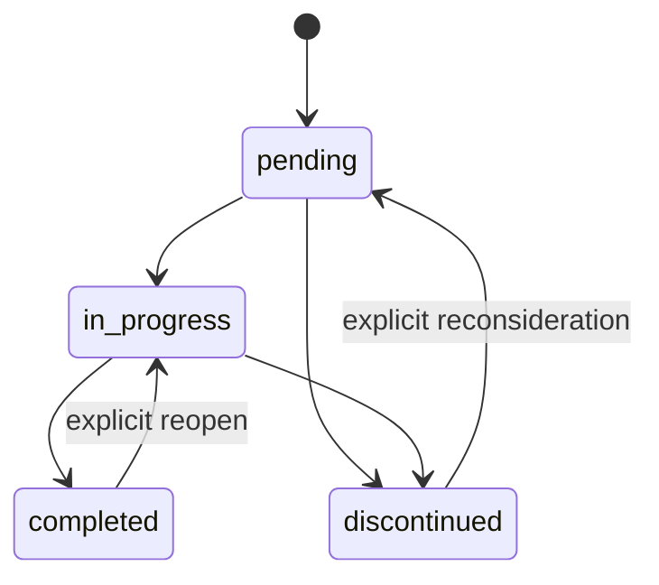

# Change planning

## Purpose

Create one reviewable contract for a logical change batch before implementation. A plan controls scope; it is not a diary of every command.

## When planning applies

Read-only work does not create a plan. A versioned change uses one of these forms:

| Class | Typical use | Required detail |
|---|---|---|
| Compact | isolated P4/P5-R1 text or metadata | objective, files, validation, rollback, status |
| Standard | functional, visual, structural, configuration, tests, docs behavior | full plan template |
| Expanded | R4/R5, security, migration, destructive work, schema or framework release | full template, gates, approval, rollback rehearsal |

The plan covers its own creation and related changelog. Group files that form one atomic outcome; do not manufacture one plan per file.

## Lifecycle

Allowed statuses are `pending`, `in_progress`, `completed`, and `discontinued`. The status field must match the directory.

## Required data

- schema and unique ID;
- description, objective, justification, and scope;
- affected files or boundaries;
- priority, risk, owner, dates, current and expected versions;
- implementation steps;
- acceptance criteria;
- validation plan and executed evidence;
- Regression impact: protected behaviors, consulted contracts, selected checks, results, limitations, and residual risk;
- rollback or explicit non-applicability;
- related plans, decisions, failures, and changelog;
- status.

Use `governance/TEMPLATE_PLAN.md`. New or substantively reopened plans use `fcvw/plan@2`. Historical `fcvw/plan@1` records remain readable without retroactive editing.

## Regression impact

Every `fcvw/plan@2` plan declares `regression_contract: required` or `not_applicable`. A required contract identifies existing behaviors and consumers that may be affected before implementation, then records final replay evidence before completion. `not_applicable` requires a concrete justification and remains subject to structural/documentation regression checks.

The section may not remain empty, generic, placeholder-only, or `pending` at completion. Use `REGRESSION_GUARDS.md` for blocking conditions and `TESTS.md` for risk-proportional evidence.

## Naming

`P{1..5}-R{1..5}-YYYY-MM-DD-{slug}.md`

Priority expresses urgency/value. Risk expresses regression, security, data, operational, and rollback exposure.

| Priority | Meaning |
|---|---|
| P1 | critical incident, security, data integrity, blocked primary use |
| P2 | high-value primary workflow or serious stability issue |
| P3 | normal feature, usability, or maintainability improvement |
| P4 | low-impact polish, documentation, isolated cleanup |
| P5 | optional experiment or future opportunity |

| Risk | Required handling |
|---|---|
| R1 | localized validation |
| R2 | focused regression checks |
| R3 | broader affected-boundary regression |
| R4 | technical review, rollback, expanded evidence |
| R5 | explicit human approval, rehearsal, residual-risk record |

Operational score may help triage, but priority and risk remain separate and score never overrides dependencies or approval.

## Gates

- Security/privacy: `SECURITY.md`.
- Data/migration: `DATA.md`.
- Refactoring/monolith: `REFACTORING.md`, `anti-monolith-guard`, `code-hygiene-refactor`.
- New skill/agent: `agent-factory`.
- Existing skill/agent change: `self-improvement`.
- Release/version: `release-checklist`.
- Regression: `REGRESSION_GUARDS.md`, `TESTS.md`.
- Framework upgrade: `OWNERSHIP.md`, `MIGRATIONS.md`.

If a gate fails, split, reduce, defer, or obtain the required approval before editing.

## Concurrency

An in-progress plan declares `owner`. Parallel agents must not modify the same files or responsibility boundary without explicit coordination. Session and plan IDs must not rely on manually incremented numbers alone.

## Completion

A plan is completed only when:

- acceptance criteria are decided;
- required validation ran and evidence is concise but reproducible;
- applicable regression checks have final results and no blocking Regression gate remains;
- gaps and residual risks are explicit;
- rollback remains possible or irreversibility was approved;
- changelog/release record exists;
- status and directory agree.

Legacy plans retain their original schema. Apply the current schema when a legacy plan is substantively reopened.

## Priority queues

`Plans/in_progress/QUEUE.md` and `Plans/pending/QUEUE.md` are project-owned operational indexes. Every plan in either directory appears exactly once in its matching queue. Queue changes and plan lifecycle changes form one transaction.

Recommendation order is:

1. valid in-progress entries before pending entries, unless a pending entry has an explicit `before_in_progress: <specific reason>` override;
2. unblocked entries before entries with unresolved dependencies;
3. `correction`, `optimization`, `code_hygiene`, `visual`, then `other`;
4. P1 through P5 within the same category, then explicit row order.

A plan link must resolve exactly to the plan file in the queue's matching state directory. Use `none`, `-`, or an empty blocker for unblocked work; use comma-separated plan IDs for internal dependencies and `external: <specific reason>` for external dependencies. Resolved, unknown, or self-referential blockers are invalid.

A category or same-category priority inversion requires a concrete override reason. Missing, stale, duplicate, wrong-target, or wrong-state queues block implementation until repaired; a provisional recommendation may be displayed but is not authoritative.

## Solution proportionality

Before adding a dependency, abstraction, wrapper, module, service, layer, or material new file, answer in order:

1. Is the behavior necessary in the approved scope?
2. Does an equivalent or reusable solution already exist in the codebase?
3. Does the language, framework, platform, or infrastructure provide a suitable native capability?
4. Does an already installed dependency satisfy the requirement?
5. If not, what evidence justifies new code or dependency?

The check is advisory for ordinary implementation and blocking when the proposal has no concrete need, duplicates an existing solution, or expands scope without approval. Simplification never overrides security, privacy, accessibility, traceability, validation, audit, data integrity, required documentation, or risk-proportional tests.

## Document relationships

Plans link affected policies and profiles through `context_files`, use portable Markdown links for related records, and remain reachable through their queue or generated plan index. A plan may not close while its related changelog, release, decision, regression, or validation evidence is an orphan.
