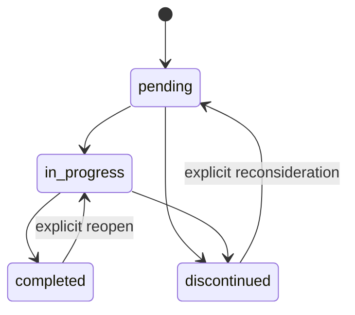

# Change planning

## Purpose

Create one reviewable contract for a logical change batch before implementation. A plan controls scope; it is not a diary of every command.

## When planning applies

Read-only work does not create a plan. A versioned change uses one of these forms:

| Class | Typical use | Required detail |
|---|---|---|
| Compact | isolated P4/P5-R1 text or metadata | `fcvw/plan-compact@1`: objective, files, validation, rollback, status |
| Standard | functional, visual, structural, configuration, tests, docs behavior | full plan template |
| Expanded | R4/R5, security, migration, destructive work, schema or framework release | full template, gates, approval, rollback rehearsal |

The plan covers its own creation and related changelog. Group files that form one atomic outcome; do not manufacture one plan per file.

## Lifecycle

```mermaid
stateDiagram-v2
    [*] --> pending
    pending --> in_progress
    pending --> discontinued
    in_progress --> completed
    in_progress --> discontinued
    completed --> in_progress: explicit reopen
    discontinued --> pending: explicit reconsideration
```

Allowed statuses are `pending`, `in_progress`, `completed`, and `discontinued`. Each plan is one file under `Plans/<status>/`; the status field must match the directory, and a state directory is created by the first plan that needs it.

## Required data

- schema and unique ID;
- description, objective, justification, and scope;
- affected files or boundaries;
- priority, risk, owner, dates, current and expected versions;
- implementation steps;
- acceptance criteria;
- validation plan and executed evidence;
- Regression impact: protected behaviors, consulted contracts, selected checks, results, limitations, and residual risk;
- rollback or explicit non-applicability;
- related plans, decisions, failures, and changelog;
- status.

Use `governance/TEMPLATE_PLAN.md` for the standard and expanded classes, and `governance/TEMPLATE_PLAN_COMPACT.md` for the compact class. New or substantively reopened plans use `fcvw/plan@2`; the compact class uses `fcvw/plan-compact@1` and is restricted by the validator to `P4`/`P5` with `R1`. Historical `fcvw/plan@1` records remain readable without retroactive editing.

## Regression impact

A compact plan (`fcvw/plan-compact@1`) declares no regression contract: its
`P4`/`P5`-`R1` band is the justification, and the validator refuses any other
combination. If the change leaves that band, convert the plan to `fcvw/plan@2`
before continuing.

Every `fcvw/plan@2` plan declares `regression_contract: required` or `not_applicable`. A required contract identifies existing behaviors and consumers that may be affected before implementation, then records final replay evidence before completion. `not_applicable` requires a concrete justification of at least 40 characters that argues the waiver instead of restating it, and remains subject to structural/documentation regression checks. The validator refuses it at risk `R3` or above and in any plan routed through `SECURITY.md`, `DATA.md`, or `MIGRATIONS.md`. Every `fcvw/plan@2` also needs a `Rollback` section containing a real procedure.

The section may not remain empty, generic, placeholder-only, or `pending` at completion. Use `REGRESSION_GUARDS.md` for blocking conditions and `TESTS.md` for risk-proportional evidence.

## Naming

`P{1..5}-R{1..5}-YYYY-MM-DD-{slug}.md`

Priority expresses urgency/value. Risk expresses regression, security, data, operational, and rollback exposure.

| Priority | Meaning |
|---|---|
| P1 | critical incident, security, data integrity, blocked primary use |
| P2 | high-value primary workflow or serious stability issue |
| P3 | normal feature, usability, or maintainability improvement |
| P4 | low-impact polish, documentation, isolated cleanup |
| P5 | optional experiment or future opportunity |

| Risk | Required handling |
|---|---|
| R1 | localized validation |
| R2 | focused regression checks |
| R3 | broader affected-boundary regression |
| R4 | technical review, rollback, expanded evidence |
| R5 | explicit human approval, rehearsal, residual-risk record |

Operational score may help triage, but priority and risk remain separate and score never overrides dependencies or approval.

## Gates

- Security/privacy: `SECURITY.md`.
- Data/migration: `DATA.md`.
- Refactoring/monolith: `REFACTORING.md`, `anti-monolith-guard`, `code-hygiene-refactor`.
- New skill/agent: `agent-factory`.
- Existing skill/agent change: `self-improvement`.
- Release/version: `release-checklist`.
- Regression: `REGRESSION_GUARDS.md`, `TESTS.md`.
- Framework upgrade: `OWNERSHIP.md`, `MIGRATIONS.md`.

If a gate fails, split, reduce, defer, or obtain the required approval before editing.

## Concurrency

An in-progress plan declares `owner`. Parallel agents must not modify the same files or responsibility boundary without explicit coordination. Session and plan IDs must not rely on manually incremented numbers alone.

## Completion

A plan is completed only when:

- acceptance criteria are decided;
- required validation ran and evidence is concise but reproducible;
- applicable regression checks have final results and no blocking Regression gate remains;
- gaps and residual risks are explicit;
- rollback remains possible or irreversibility was approved;
- changelog/release record exists;
- status and directory agree.

Legacy plans retain their original schema. Apply the current schema when a legacy plan is substantively reopened.

## Priority queue

There is no queue file: the queue is derived from the plans in `Plans/in_progress/` and `Plans/pending/`. Each active plan may declare, in its frontmatter:

- `category`: `correction`, `optimization`, `code_hygiene`, `visual` or `other` (default `other`);
- `blocked_external: <specific reason>` for a non-plan condition;
- `before_in_progress: <specific reason>` for a pending plan that must run before active work.

Blockers are the unresolved `depends_on` IDs plus any external reason. Recommendation order is:

1. an unblocked pending plan with `before_in_progress`, then in-progress plans, then pending plans;
2. unblocked plans before blocked plans;
3. `correction`, `optimization`, `code_hygiene`, `visual`, then `other`;
4. P1 through P5 within the same category, then `created_at`, then ID.

Because the order is computed, no inversion or row order needs justifying and the queue can never disagree with the plans. `python FCVW/tools/plan_queue_fcvw.py --root . --recommend` prints the next plan; `--output .fcvw-cache/plan-queue.md` writes a disposable view. An invalid category, a vague external reason or a misplaced `before_in_progress` blocks the recommendation. Pre-V0.20.0 `QUEUE.md` files and `queue.d/` fragments are ignored and reported until their fields move into the plans.

## Plan dependencies

`depends_on` is an optional first-level list of blocking prerequisite plan IDs on `fcvw/plan@2`. Non-blocking associations remain Markdown links under Related records and must not be placed in `depends_on`.

A plan with `depends_on` contains a machine-readable `## Dependency validation` table with five columns: Dependency, Blocking reason, Unblock criteria, Status, and Evidence. Allowed dependency statuses are `pending`, `satisfied`, and `invalidated`.

- `pending` remains unresolved and blocks the plan in the derived queue;
- `satisfied` requires the prerequisite plan to be `completed` plus concrete validation evidence, and stops blocking without deleting the historical `depends_on` relation;
- `invalidated` applies when the prerequisite was `discontinued`; it remains blocking until the dependent plan is explicitly replanned, replaced, or discontinued;
- dependency cycles, missing or ambiguous plan IDs, self-dependencies, and evidence-free satisfaction are invalid;
- `blocked_external: <specific reason>` remains available for non-plan conditions.

## Solution proportionality

Before adding a dependency, abstraction, wrapper, module, service, layer, or material new file, answer in order:

1. Is the behavior necessary in the approved scope?
2. Does an equivalent or reusable solution already exist in the codebase?
3. Does the language, framework, platform, or infrastructure provide a suitable native capability?
4. Does an already installed dependency satisfy the requirement?
5. If not, what evidence justifies new code or dependency?

The check is advisory for ordinary implementation and blocking when the proposal has no concrete need, duplicates an existing solution, or expands scope without approval. Simplification never overrides security, privacy, accessibility, traceability, validation, audit, data integrity, required documentation, or risk-proportional tests.

## Framework proportionality

The proportionality rule above also applies to the framework itself. A new policy
document, schema, derived surface, or template is justified only when a matching
rule exists that the validator can execute. Prose that no tool checks is not
governance: it is documentation, and it belongs inside an existing document
rather than creating one more surface to maintain, review, and translate into
four languages.

Before adding a surface to FCVW, answer in order:

1. Does an existing document or schema already cover this?
2. Which validator rule will make the new surface checkable?
3. Which `CONTEXT_MAP.md` route makes an agent load it, and under which trigger?
4. What is the per-session token cost, and who pays it?
5. What is removed in exchange?

A new surface without a matching rule is a proportionality failure, and the same
advisory or blocking gate used for application work applies here.

## Document relationships

Plans link affected policies and profiles through `context_files`, use portable Markdown links for related records, and remain reachable through their state directory. A plan may not close while its related changelog, release, decision, regression, or validation evidence is an orphan.
