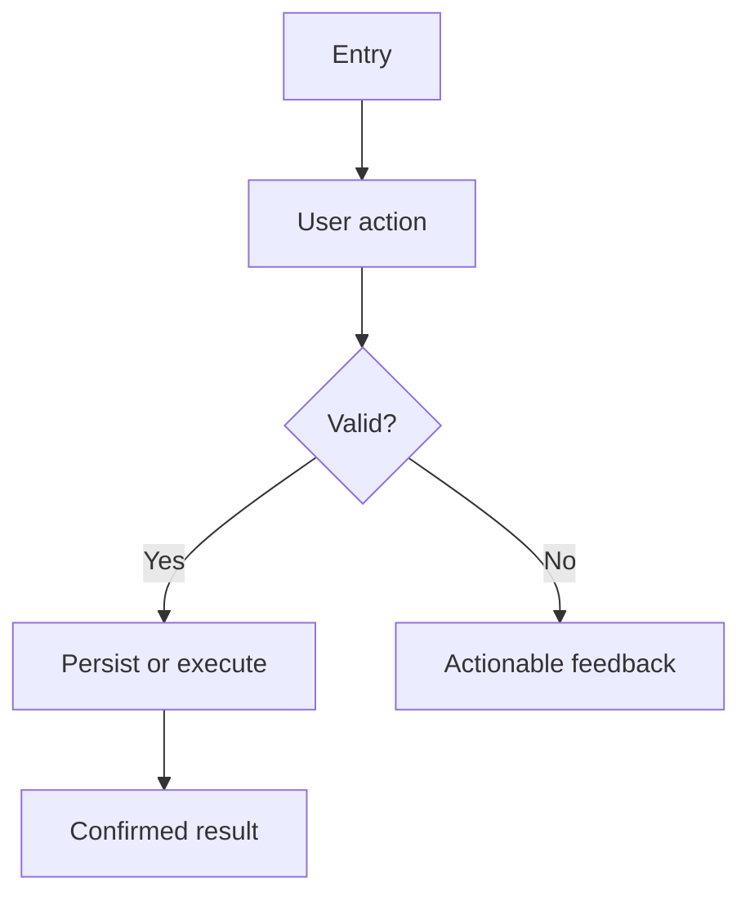

# Project profile

The single project-owned profile: identity and scope, stack, environment, design, performance and workflows. [SECURITY.md](SECURITY.md), [DATA.md](DATA.md) and [APP_RULES.md](APP_RULES.md) stay separate because they are the targets of mandatory security, data and application-rule routes.

Complete it during instantiation (see [INSTANTIATION.md](INSTANTIATION.md)). Placeholders are valid while `instantiation_status` is `pending`. When a section does not apply yet, list its heading in `not_applicable_sections` (for example `Performance`) and explain why in `not_applicable_reason`; *Identity and scope* always applies. Load only the section the task needs.

## Identity and scope

### Identity

| Field | Value |
|---|---|
| Project name | `<project_name>` |
| Short name | `<short_name>` |
| Repository | `<repository_or_not_applicable>` |
| Product owner | `<owner>` |
| Current application version | `V0.0.1` |
| Current FCVW baseline | see `FRAMEWORK_LOCK.md` |
| Status | `discovery` |

### Purpose, users and problem

- Primary users: `<users>`
- Problem: `<problem>`
- Desired outcome: `<outcome>`

### Expected outcomes

-

### In scope

| Capability | User value | Acceptance boundary |
|---|---|---|
| | | |

### Out of scope

| Excluded item | Reason | Revisit trigger |
|---|---|---|
| | | |

### Non-functional boundaries

- Security and privacy: see [SECURITY.md](SECURITY.md)
- Availability and recovery:
- Performance: see [Performance](#performance)
- Accessibility:
- Supported environments:
- Data retention: see [DATA.md](DATA.md)

### Canonical sources

| Concern | Source |
|---|---|
| Application version | `<single_runtime_or_manifest_source>` |
| Data | [DATA.md](DATA.md) |
| Security | [SECURITY.md](SECURITY.md) |
| Cross-cutting rules | [APP_RULES.md](APP_RULES.md) |
| Framework version | [FRAMEWORK_LOCK.md](FRAMEWORK_LOCK.md) |

### Key risks and unknowns

| Risk or question | Impact | Owner | Next action |
|---|---|---|---|
| | | | |

### Change rule

A plan may refine an existing boundary. Expanding product scope requires explicit user or product-owner approval and synchronization of this section and affected acceptance criteria. Do not duplicate release history here; link application changelogs and framework release records instead.

## Stack

### Application

| Concern | Selection | Version/source | Notes |
|---|---|---|---|
| Application type | `<web, desktop, mobile, service, library>` | | |
| Primary language | `<language>` | | |
| Runtime | `<runtime>` | | |
| UI | `<framework or not_applicable>` | | |
| Backend | `<framework or not_applicable>` | | |
| Persistence | `<database/files or not_applicable>` | | |
| Deployment | `<target>` | | |

### Canonical version sources

- Application version: `<single source path>`.
- Framework version: `FRAMEWORK_LOCK.md`.
- Dependency versions: lockfile or platform-native equivalent.

Do not copy the application version into multiple documents unless it is derived automatically.

### Required commands

| Purpose | Command | Environment |
|---|---|---|
| Install | `<command>` | |
| Type/static check | `<command>` | |
| Lint | `<command>` | |
| Unit tests | `<command>` | |
| Integration tests | `<command>` | |
| Build | `<command>` | |
| Start | `<command>` | |

### Boundaries

- Supported operating systems:
- Supported browsers/clients:
- Required external services:
- Unsupported or intentionally excluded technologies:

### Governance layer

- Framework: FrameCode VibeWork `V0.13.0`.
- Plans: `FCVW/Plans/`.
- Application releases: `FCVW/changelogs/`.
- Framework baseline: `FCVW/FRAMEWORK_LOCK.md`.
- Optional validator: `tools/validate_fcvw.py`.

### Optional product QA capability

[QA](skills/QA/SKILL.md) is available on demand. The host supplies authorized browser, native UI, terminal, protocol, harness, simulator or hardware interaction capabilities as applicable; the framework installs no execution runtime or service. Record actual project capability and commands when instantiated.

## Environment

### Environments

| Environment | Purpose | Data policy | Deployment owner | Promotion gate |
|---|---|---|---|---|
| Development | | | | |
| Test | | | | |
| Staging | | | | |
| Production | | | | |

Use only environments that exist. Document compensating controls when physical separation is unavailable.

### Configuration

- Commit safe examples; never commit live secrets.
- Record variable name, purpose, required/optional status, safe example, and validation.
- Define precedence among CLI, environment, profile files, and defaults.
- Fail closed when a required production setting is missing.

### Promotion

1. Build an immutable candidate.
2. Validate in the source environment.
3. Back up or establish rollback.
4. Promote without silently changing configuration.
5. Run health, authentication, data, and primary-flow smoke checks.
6. Record evidence and publish the release only after target validation.

### Runtime profile

- Start command:
- Stop command:
- Health endpoint/check:
- Readiness endpoint/check:
- Logs:
- Backup:
- Rollback:
- Supported host/port rules:

### Environment variables

| Name | Required | Secret | Safe example | Validation |
|---|---|---|---|---|
| | | | | |

## Design

### Experience principles

- Primary users and environment:
- Cognitive-load constraints:
- Accessibility target:
- Responsive/mobile commitment:
- Supported themes:

### Physical source of truth

Design tokens must be implemented in `<code path>`. This document explains intent and constraints; it does not replace runtime tokens.

### Tokens

| Group | Canonical names | Rules |
|---|---|---|
| Color | | |
| Typography | | |
| Spacing | | |
| Radius | | |
| Border | | |
| Elevation | | |
| Motion | | |
| Z-index/layers | | |

### Component contracts

For shared components define states, keyboard behavior, focus, labels, error feedback, density, loading, empty, disabled, destructive, and responsive behavior.

### Validation

- Verify keyboard-only operation and visible focus.
- Check contrast and non-color cues.
- Test at declared viewport breakpoints and zoom.
- Compare screenshots only when visual fidelity matters.
- Confirm motion respects reduced-motion preferences.
- Record exceptions with owner and review date.

## Performance

Optimize only after establishing a user-visible or operational problem and a reproducible baseline.

### Budgets

| Scenario | Metric | Target | Hard limit | Measurement |
|---|---|---|---|---|
| Startup | | | | |
| Primary interaction | | | | |
| API/service | | | | |
| Build/artifact | | | | |
| Memory/storage | | | | |

### Investigation contract

1. Reproduce under a documented environment.
2. Measure before changing.
3. Identify the dominant bottleneck.
4. Change the smallest responsible boundary.
5. Measure after changing with equivalent inputs.
6. Check correctness, accessibility, resource use, and regressions.

Do not claim percentage improvement without retaining the commands, sample size, environment, and before/after measurements.

## Workflows

This is an application-owned profile. Replace or explicitly waive every placeholder before setting `instantiation_status: complete`.

### Runtime architecture

| Layer | Responsibility | Source path | External dependency |
|---|---|---|---|
| `<layer>` | | | |

### Initialization

1. `<load configuration>`
2. `<initialize dependencies>`
3. `<verify readiness>`
4. `<serve the primary workflow>`

### Shutdown and recovery

- Graceful shutdown:
- State persistence:
- Interrupted-operation recovery:
- Health/readiness checks:

### Primary user workflow

#### Steps

1. `<step>`
2. `<step>`
3. `<step>`

#### Failure paths

| Failure | User feedback | Recovery | Evidence |
|---|---|---|---|
| | | | |

### Secondary workflows

Create one subsection per meaningful workflow. Link detailed module documentation instead of turning this file into a screen-by-screen monolith.

### Governance workflow

Request → context routing → plan → scoped implementation → validation → application changelog → optional knowledge promotion.

Framework upgrades follow `OWNERSHIP.md` and update `FRAMEWORK_LOCK.md`; they do not change the application version unless application behavior also changes.
