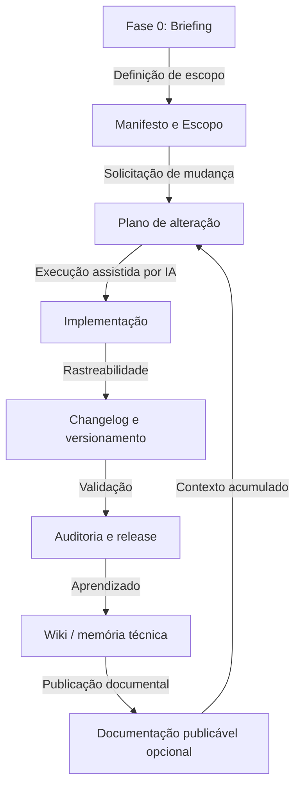
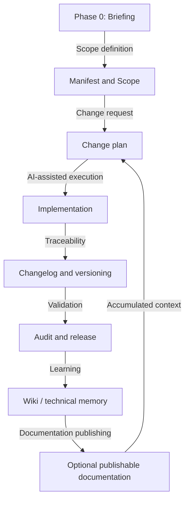

# FrameCode VibeWork Framework

*Select Language / Selecione o Idioma:*
- [Português](#português)
- [English](#english)

---

## Português

**FrameCode VibeWork** é um framework de governança documental e técnica para desenvolvimento de aplicações assistido por IA. Ele reduz perda de contexto entre sessões ao combinar planos formais, changelogs, auditorias, troubleshooting, decisões arquiteturais, design system declarativo e uma LLM Wiki mantida em Markdown.

### Como Funciona

O framework usa um ciclo de vida explícito para garantir que mudanças sejam justificadas, planejadas, implementadas, validadas e registradas.



### Pilares

#### 1. Governança por planos

Nenhuma alteração funcional, visual, estrutural ou documental deve ser aplicada sem plano correspondente em `Plans/`.

#### 2. Rastreabilidade por versão

Toda alteração em arquivo versionado deve ser registrada em `changelogs/Vx.y.z.md`, com plano relacionado, arquivos afetados, validação e riscos residuais.

#### 3. Memória técnica incremental

A pasta `wiki/` segue o padrão LLM Wiki: fontes brutas, páginas sintetizadas, índice, log, links internos, estados de confiança e lint periódico.

> **Portabilidade e Reuso:** O conhecimento acumulado na `wiki/` (padrões, decisões, troubleshooting) pode e deve ser portado e reutilizado em novos projetos para acelerar o desenvolvimento assistido por IA e manter a consistência técnica entre diferentes aplicações.

#### 4. Design system declarativo

O arquivo `DESIGN.md` centraliza tokens, regras visuais, contratos de componentes e critérios de experiência. A antiga pasta `snippets/` foi descontinuada; exemplos físicos devem ser gerados na aplicação instanciada quando necessários.

#### 5. Separação entre framework e projeto

A pasta `governance/` preserva templates genéricos. Os documentos preenchidos do projeto ficam na raiz da aplicação instanciada, não na raiz do framework-base. A instanciação e as regras de renomeação estão em `INSTANTIATION.md`.

#### 6. Motor de Habilidades (ASE)

A pasta `skills/` armazena procedimentos técnicos de alta densidade carregados sob demanda pelo agente de IA — nunca pré-carregados no prompt. Isso preserva a janela de contexto enquanto disponibiliza checklists especializados quando necessários.

Habilidades ativas: `agent-aegis`, `agent-hephaestus`, `agent-hermes`, `agnix-linter`, `aicc-compact`, `brainstorming-and-tdd`, `git-conventional-commits`, `memory-rotation`, `obsidian-markdown`, `orchestrator`, `project-instantiation`, `release-checklist`, `systematic-debugging`, `wiki-lint`.

### Estrutura De Diretórios

A estrutura detalhada e auditável do framework é mantida em `FILESYSTEM.md`. Este README registra apenas o mapa operacional resumido:

- raiz do repositório: pertence à aplicação em desenvolvimento; mantém `AGENTS.md` e arquivos ponte/configuração.
- `FCVW/`: fonte canônica dos documentos, governança, memória, planos, changelogs e habilidades do framework.
- `FCVW/docs/`: artefato publicável da documentação do framework; não substitui uma pasta `docs/` permanente na raiz.
- `FCVW/FILESYSTEM.md`: fonte de verdade para a árvore completa e para o estado esperado dos diretórios.
- `FCVW/CONTEXT_MAP.md`: mapa compacto de carregamento seletivo por tipo de sessão.

### Consumo de Tokens por Cenário

Para maximizar a transparência de custos de chamadas de APIs de LLMs, o framework mapeia estimativas de planejamento para cada cenário de desenvolvimento com base em suas políticas ativas:

| Cenário Mapeado | Documentos Ingeridos | Custo Inicial (Sem AICC) | Custo por Turno com AICC | Economia com AICC |
| :--- | :--- | :---: | :---: | :---: |
| **Bugfix / Troubleshooting** | `AGENTS.md` + `TROUBLESHOOTING.md` + `PLANNING.md` | ~5.000 tokens | **~1.200 tokens** | **-76%** |
| **Nova Funcionalidade** | `AGENTS.md` + `SCOPE.md` + `PLANNING.md` + `DESIGN.md` | ~7.000 tokens | **~1.500 tokens** | **-78%** |
| **Componentes / UI** | `AGENTS.md` + `DESIGN.md` | ~4.000 tokens | **~900 tokens** | **-77%** |
| **Refatoração** | `AGENTS.md` + `REFACTORING.md` + `PLANNING.md` | ~8.000 tokens | **~1.800 tokens** | **-77%** |
| **Briefing / Instanciação** | `AGENTS.md` + `INSTANTIATION.md` + `BRIEFING.md` + `MANIFEST.md` | ~8.500 tokens | **~2.000 tokens** | **-76%** |
| **Release** | `CONTEXT_MAP.md` + `skill:release-checklist` (JIT) | ~2.500 tokens | **~600 tokens** | **-76%** |

*Nota: As estimativas são valores de referência para planejamento, não medições recalibradas automaticamente após cada mudança documental. Recalibre-as após crescimento material dos documentos de governança. 1 token ≈ 4 caracteres em inglês ou ~3 caracteres em português.*

### Como Usar

#### 1. Copiar ou clonar

Use este repositório como base para um novo projeto ou mantenha-o como framework central.

```bash
git clone https://github.com/Sistema2D/FrameCode-VibeWork.git meu-projeto
cd meu-projeto
```

#### 2. Instanciar

Leia `AGENTS.md` e `INSTANTIATION.md`. A instanciação não depende de script automático: renomeações e substituições devem ser feitas explicitamente, preservando templates em `governance/` e `wiki/templates/`.

#### 3. Executar Fase 0

Preencha `BRIEFING.md`, atualize `MANIFEST.md`, `STACK.md`, `SCOPE.md` e gere o `README.md` da aplicação na raiz, registrando a alteração por plano e changelog.

#### 4. Trabalhar com IA

Ao solicitar mudanças, peça para o agente seguir `AGENTS.md`. Para consultas, análise e revisão sem edição de arquivos, plano não é obrigatório. Para qualquer alteração, o fluxo de plano e changelog é obrigatório.

---

## English

**FrameCode VibeWork** is a technical and document-based governance framework for AI-assisted application development. It reduces context loss between sessions by combining formal plans, changelogs, audits, troubleshooting, architectural decisions, a declarative design system, and an LLM Wiki maintained in Markdown.

### How It Works

The framework uses an explicit lifecycle to ensure that changes are justified, planned, implemented, validated, and recorded.



### Pillars

#### 1. Governance by Plans

No functional, visual, structural, or document change should be applied without a corresponding plan in `Plans/`.

#### 2. Version Traceability

Every change in a versioned file must be recorded in `changelogs/Vx.y.z.md`, with related plans, affected files, validation, and residual risks.

#### 3. Incremental Technical Memory

The `wiki/` folder follows the LLM Wiki standard: raw sources, synthesized pages, index, log, internal links, confidence states, and periodic linting.

> **Portability and Reuse:** The knowledge accumulated in the `wiki/` (patterns, decisions, troubleshooting) can and should be ported and reused in new projects to accelerate AI-assisted development and maintain technical consistency across different applications.

#### 4. Declarative Design System

`DESIGN.md` centralizes tokens, visual rules, component contracts, and experience criteria. The former `snippets/` folder is discontinued; physical examples should be generated inside the instantiated application when needed.

#### 5. Framework and Project Separation

The `governance/` folder preserves generic templates. Filled project documents reside at the instantiated application root, not at the framework-baseline root. Instantiation and renaming rules are in `INSTANTIATION.md`.

#### 6. AI Skills Engine (ASE)

The `skills/` folder stores high-density technical procedures loaded on-demand by the AI agent — never pre-loaded into the prompt. This preserves the context window while making specialized checklists available when needed.

Active skills: `agent-aegis`, `agent-hephaestus`, `agent-hermes`, `agnix-linter`, `aicc-compact`, `brainstorming-and-tdd`, `git-conventional-commits`, `memory-rotation`, `obsidian-markdown`, `orchestrator`, `project-instantiation`, `release-checklist`, `systematic-debugging`, `wiki-lint`.

### Directory Structure

The detailed and auditable framework structure is maintained in `FILESYSTEM.md`. This README records only the operational summary:

- repository root: owned by the application under development; keeps `AGENTS.md` and bridge/configuration files.
- `FCVW/`: canonical source for framework documents, governance, memory, plans, changelogs, and skills.
- `FCVW/docs/`: publishable framework documentation artifact; it does not require a permanent root `docs/` folder.
- `FCVW/FILESYSTEM.md`: source of truth for the complete tree and expected directory state.
- `FCVW/CONTEXT_MAP.md`: compact selective loading map by session type.

### Token Consumption by Scenario

To maximize transparency and API call cost-efficiency with LLMs, the framework maps planning estimates for each development scenario based on its active policies:

| Mapped Scenario | Ingested Documents | Initial Load (No AICC) | Continuous Turn Cost (With AICC) | Savings with AICC |
| :--- | :--- | :---: | :---: | :---: |
| **Bugfix / Troubleshooting** | `AGENTS.md` + `TROUBLESHOOTING.md` + `PLANNING.md` | ~5,000 tokens | **~1,200 tokens** | **-76%** |
| **New Feature** | `AGENTS.md` + `SCOPE.md` + `PLANNING.md` + `DESIGN.md` | ~7,000 tokens | **~1,500 tokens** | **-78%** |
| **UI / Components** | `AGENTS.md` + `DESIGN.md` | ~4,000 tokens | **~900 tokens** | **-77%** |
| **Refactoring** | `AGENTS.md` + `REFACTORING.md` + `PLANNING.md` | ~8,000 tokens | **~1,800 tokens** | **-77%** |
| **Briefing / Instantiation** | `AGENTS.md` + `INSTANTIATION.md` + `BRIEFING.md` + `MANIFEST.md` | ~8,500 tokens | **~2,000 tokens** | **-76%** |
| **Release** | `CONTEXT_MAP.md` + `skill:release-checklist` (JIT) | ~2,500 tokens | **~600 tokens** | **-76%** |

*Note: Estimates are planning reference values, not measurements automatically recalibrated after every documentation change. Recalibrate them after material growth in the governance documents. 1 token ≈ 4 characters in English or ~3 characters in Portuguese.*

### How to Use

#### 1. Copy or Clone

Use this repository as a base for a new project or keep it as a central framework.

```bash
git clone https://github.com/Sistema2D/FrameCode-VibeWork.git my-project
cd my-project
```

#### 2. Instantiate

Read `AGENTS.md` and `INSTANTIATION.md`. Instantiation does not rely on automatic scripts: renaming and replacements must be done explicitly, preserving templates in `governance/` and `wiki/templates/`.

#### 3. Execute Phase 0

Fill out `BRIEFING.md`, update `MANIFEST.md`, `STACK.md`, `SCOPE.md`, generate the application root `README.md`, and record the change via plan and changelog.

#### 4. Work with AI

When requesting changes, ask the agent to follow `AGENTS.md`. For queries, analysis, and reviews without file editing, a plan is not mandatory. For any modification, the plan and changelog workflow is mandatory.

---

## Obsidian

Abra a pasta raiz como um vault no Obsidian para visualizar links entre decisões, falhas, padrões, auditorias, releases e sínteses da wiki. / Open the root folder as a vault in Obsidian to visualize links between decisions, failures, patterns, audits, releases, and wiki syntheses.

## Créditos / Credits

O conceito de LLM Wiki usado como inspiração para a memória técnica incremental deste framework é creditado a Andrej Karpathy, autor do gist [LLM Wiki](https://gist.github.com/karpathy/442a6bf555914893e9891c11519de94f). / The LLM Wiki concept used as inspiration for the incremental technical memory of this framework is credited to Andrej Karpathy, author of the [LLM Wiki](https://gist.github.com/karpathy/442a6bf555914893e9891c11519de94f) gist.

Se este framework for útil para o seu trabalho, você pode apoiar o desenvolvimento pelo Buy Me a Coffee: / If this framework is useful for your work, you can support development via Buy Me a Coffee:

<a href="https://www.buymeacoffee.com/hugomelovek"></a>

## Licença / License

Este projeto está licenciado sob a licença MIT. Veja `LICENSE`. / This project is licensed under the MIT license. See `LICENSE`.

## Star History

[](https://star-history.com/#Sistema2D/FrameCode-VibeWork&Date)
