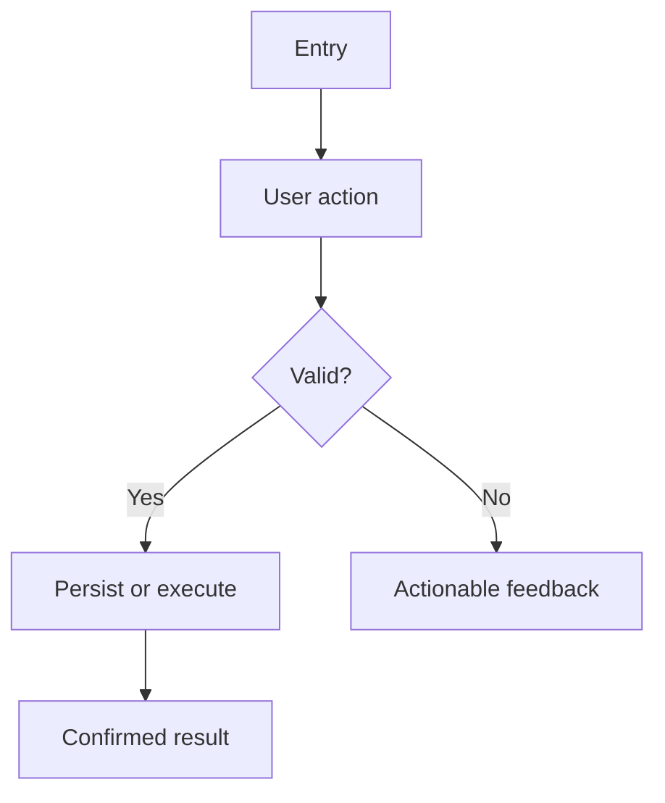

# Application workflows

This is an application-owned profile. Replace or explicitly waive every placeholder before setting `instantiation_status: complete`.

## Runtime architecture

| Layer | Responsibility | Source path | External dependency |
|---|---|---|---|
| `<layer>` | | | |

## Initialization

1. `<load configuration>`
2. `<initialize dependencies>`
3. `<verify readiness>`
4. `<serve the primary workflow>`

## Shutdown and recovery

- Graceful shutdown:
- State persistence:
- Interrupted-operation recovery:
- Health/readiness checks:

## Primary user workflow

### Steps

1. `<step>`
2. `<step>`
3. `<step>`

### Failure paths

| Failure | User feedback | Recovery | Evidence |
|---|---|---|---|
| | | | |

## Secondary workflows

Create one subsection per meaningful workflow. Link detailed module documentation instead of turning this file into a screen-by-screen monolith.

## Governance workflow

Request → context routing → plan → scoped implementation → validation → application changelog → optional knowledge promotion.

Framework upgrades follow `OWNERSHIP.md` and update `FRAMEWORK_LOCK.md`; they do not change the application version unless application behavior also changes.
