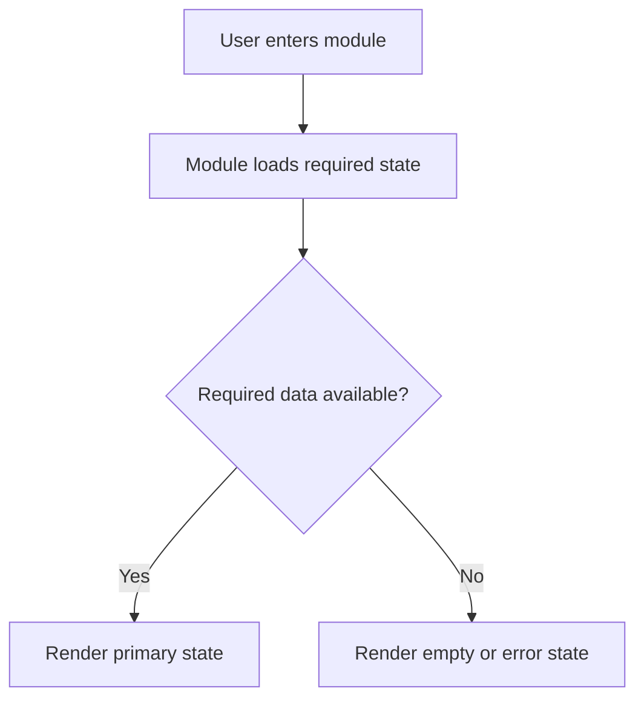
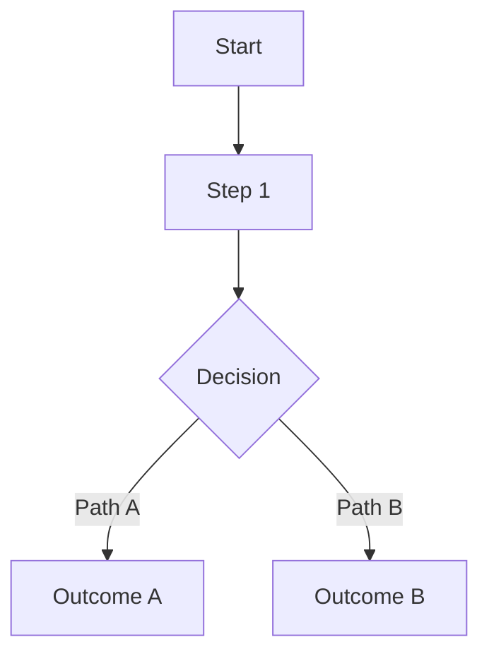

# Template: application documentation

Sections for application-owned documentation under the rules of [APPLICATION_DOCUMENTATION.md](../APPLICATION_DOCUMENTATION.md): the docs folder README, a module, a flow, an API, a data schema, an AI feature, environment and secrets, and a data migration runner. Copy only the section that matches the document being written.

## Application Documentation

This folder contains documentation for the application modules, screens, pages, components, and flows.

It is application-owned. The FCVW framework defines the rules in `FCVW/APPLICATION_DOCUMENTATION.md`, but filled documents in this folder describe this specific application.

### Structure

```text
docs/
|-- README.md
|-- modules/
|   |-- TEMPLATE_MODULE.md
|   \-- <module-name>.md
\-- flows/
    |-- TEMPLATE_FLOW.md
    \-- <flow-name>.md
```

### Required Practice

- Create one module document for each relevant page, screen, module, or major component.
- Create flow documents for cross-module workflows.
- Use Mermaid diagrams when they clarify behavior, dependencies, or state transitions.
- Keep documentation changes in the same FCVW plan and changelog as the implementation change.

### Module Index

| Module | Document | Owner | Last Updated |
|---|---|---|---|
| | | | |

### Flow Index

| Flow | Document | Owner | Last Updated |
|---|---|---|---|
| | | | |

## Module: <module name>

### Objective

<Describe the module purpose and user value.>

### Related Files

| Path | Role |
|---|---|
| | |

### Related Pages / Components / Services

-

### Inputs

| Input | Source | Validation |
|---|---|---|
| | | |

### Outputs

| Output | Destination | Notes |
|---|---|---|
| | | |

### Business Rules

-

### Internal Dependencies

-

### External Dependencies

-

### User Events and Actions

| Event / Action | Expected Result |
|---|---|
| | |

### States

| State | Description | Trigger |
|---|---|---|
| Initial | | |
| Loading | | |
| Empty | | |
| Error | | |
| Success | | |

### Validation Criteria

-

### Known Risks

-

### Operating Flow



### Change History

| Date | Version / Plan | Change |
|---|---|---|
| | | |

## Flow: <flow name>

### Objective

<Describe what this flow accomplishes and why it matters.>

### Entry Points

-

### Actors

-

### Related Modules

| Module | Documentation |
|---|---|
| | |

### Related Files

| Path | Role |
|---|---|
| | |

### Main Flow



### Alternative Flows

| Condition | Flow | Expected Outcome |
|---|---|---|
| | | |

### Error and Recovery Paths

| Error / Failure | Recovery | User Feedback |
|---|---|---|
| | | |

### Data and State Transitions

| State Before | Event | State After |
|---|---|---|
| | | |

### Validation Criteria

-

### Known Risks

-

### Change History

| Date | Version / Plan | Change |
|---|---|---|
| | | |

## API Endpoint Contract Specification

Use this template to document the physical contract of any new or modified API route in the application before writing implementation logic.

---

### 1. Route Summary

*   **Path:** `/api/v1/resource`
*   **Method:** `GET` / `POST` / `PUT` / `DELETE`
*   **Authentication Required:** Yes / No (Role: `user` / `admin`)
*   **Version:** `v1`

---

### 2. Request Contract

#### 2.1 URL Parameters (if any)
| Parameter | Type | Required | Description |
|---|---|---|---|
| `id` | UUID / Integer | Yes | Unique identifier of the target resource |

#### 2.2 Query Parameters (if any)
| Parameter | Type | Required | Default | Description |
|---|---|---|---|---|
| `page` | Integer | No | `1` | Pagination offset index |
| `limit` | Integer | No | `20` | Max entries to return |

#### 2.3 Body Payload (JSON format)
```json
{
  "name": "Required string field",
  "category": "Optional string matching allowed enum values",
  "tags": ["Array of string labels"]
}
```

---

### 3. Response Contract

#### 3.1 Success Response (`200 OK` or `201 Created`)
```json
{
  "success": true,
  "data": {
    "id": "uuid-string",
    "name": "Resource Name",
    "category": "default",
    "tags": [],
    "created_at": "YYYY-MM-DDTHH:MM:SSZ"
  }
}
```

#### 3.2 Error Responses
*   `400 Bad Request` — Validation failed:
    ```json
    {
      "success": false,
      "error": "validation_error",
      "message": "Field 'name' is required."
    }
    ```
*   `401 Unauthorized` — Expired or invalid token.
*   `404 Not Found` — Resource ID does not exist.

## Template: Data Schema Record

Copy this content when defining a new persistence format (JSON, database, CSV, etc.).

```markdown
# Schema: <Data Name>

## Schema Version

`1`

## File or Table

- Path/Table: `<path>`

## Purpose

- <Describe what this data is used for.>

## Fields

| Field | Type | Required | Default Value | Description |
|---|---|---|---|---|
| | | | | |

## SQL DDL Blueprint

*Use this standard SQLite DDL code to generate or reset the physical table:*

```sql
CREATE TABLE IF NOT EXISTS <table_name> (
    id INTEGER PRIMARY KEY AUTOINCREMENT,
    -- Define columns here...
    created_at TEXT DEFAULT CURRENT_TIMESTAMP
);
```

## Migration Script Mapping

- **Init Migration:** `data/migrations/V1__init_<table_name>.sql`
- **Upgrades Mapping:**
  | Target Version | Migration Script | Rollback Script | Description |
  |---|---|---|---|
  | `2` | `data/migrations/V2__upgrade.sql` | `data/migrations/V2__rollback.sql` | |

## Validation Rules

- <e.g., non-null fields, date format, etc.>

## Sensitive Data

- <List if there are tokens, names, emails, or private data.>

## Observations

- <Additional notes on integrity or performance.>
```

## Template: AI Feature Specification

Copy this content to a new file or inside a plan when defining a new AI feature.

```markdown
# AI Feature: <Name>

## Objective

- <Describe the practical goal of the feature.>

## Usage Type

`simple chat` / `chat with context` / `RAG` / `continuous learning` / `agent with tools`

## Inputs

- <Describe what the user sends or what is captured from the system.>

## Outputs

- <Describe the expected format of the response (text, JSON, action).>

## Model/Runtime

- <Provider/runtime and exact model identifier, or selection policy.>

## Context Used

- <Which files, history, or databases are sent to the model.>

## Sources Displayed

- <How the user will know the origin of the information.>

## Action Boundaries

- <What the feature CANNOT do (e.g., delete without confirmation).>

## Risks

- <Hallucination, cost, latency, context leakage.>

## Minimum Tests

- <Mandatory test cases for this feature.>
```

## Template: Project Environment & Secrets Configuration

Save a completed copy of this document as your project's local configurations if applicable.

---

### 1. Required Variables Reference

Document all variables needed for local operation here.

| Variable Name | Role | Expected Value Format | Default Value | Notes |
|---|---|---|---|---|
| `PORT` | Local server port | Integer (e.g., 3000) | `3000` | — |
| `DB_CONNECTION` | Database connection string | URI string | `postgresql://localhost:5432` | Local dev DB |
| `USE_MOCKS` | Flag for sandbox mock data | Boolean (`true`/`false`) | `true` | Set true for AI agents |
| `API_GATEWAY_URL` | Microservices entry | URL | `https://dev.api.internal` | Local fallback available |

---

### 2. Secrets Insertion Procedures

Provide precise instructions on how developers and CI/CD pipelines should retrieve and inject active secrets:

#### 2.1 Local Workspace Injection
1. Copy `.env.example` to `.env` in the project root.
2. Request a developer sandbox account from the Lead Developer.
3. Replace the placeholder tokens in `.env` with your sandbox credentials.
4. **Never commit the `.env` file.**

#### 2.2 CI/CD Integration
* In your CI/CD platform (e.g., GitHub Actions, GitLab CI), navigate to Repository Settings -> Secrets.
* Inject all variables required by tests and builds using their exact names listed in the table above.

## Template: data migration runner

This generic template implements the "Automated Schema Update Engine" described in `FCVW/DATA.md` Section 12.
When instantiating a new project, the AI agent or developer must adapt this logic into the actual application codebase (e.g., in Node.js, Python, or Go) to ensure databases are safely upgraded on startup.

### The Logic (Pseudo-code / Node.js standard)

```javascript
/**
 * FCVW Automated Schema Update Engine
 * Runs on application startup.
 * Ensures the database schema matches the version recorded in FCVW/DATA.md
 */

const fs = require('fs');
const path = require('path');
const db = require('./db_connection'); // Your SQLite or Postgres driver

const TARGET_VERSION = 3; // Must match the version defined in DATA.md

async function runMigrations() {
  console.log("Checking database schema version...");

  // 1. Check current schema metadata
  // Create table if it does not exist (for brand new databases)
  await db.exec(`
    CREATE TABLE IF NOT EXISTS schema_metadata (
        version INTEGER PRIMARY KEY,
        applied_at TEXT NOT NULL,
        description TEXT NOT NULL
    );
  `);

  const row = await db.get("SELECT MAX(version) as current_version FROM schema_metadata");
  const currentVersion = row?.current_version || 0;

  if (currentVersion >= TARGET_VERSION) {
    console.log(`Database is up to date (Version ${currentVersion}).`);
    return;
  }

  console.log(`Upgrading database from version ${currentVersion} to ${TARGET_VERSION}...`);

  // 2. Automated Backup
  const dbPath = path.join(__dirname, '../data/app.db');
  const backupPath = path.join(__dirname, '../data/app.db.bak');
  if (fs.existsSync(dbPath)) {
      fs.copyFileSync(dbPath, backupPath);
      console.log("Backup created at app.db.bak");
  }

  // 3. Apply Migrations Sequentially
  for (let v = currentVersion + 1; v <= TARGET_VERSION; v++) {
    const migrationFile = path.join(__dirname, `../data/migrations/V${v}.sql`);

    if (!fs.existsSync(migrationFile)) {
      throw new Error(`Migration file missing: V${v}.sql`);
    }

    const sqlScript = fs.readFileSync(migrationFile, 'utf8');

    try {
      // Execute in strict transaction
      await db.exec('BEGIN TRANSACTION;');
      await db.exec(sqlScript);
      await db.exec(`
        INSERT INTO schema_metadata (version, applied_at, description)
        VALUES (${v}, datetime('now'), 'Applied migration V${v}');
      `);
      await db.exec('COMMIT;');
      console.log(`Migration V${v} applied successfully.`);
    } catch (error) {
      // 4. Failure Recovery / Rollback
      await db.exec('ROLLBACK TRANSACTION;');
      console.error(`FATAL: Migration V${v} failed! Rolled back transaction.`, error);

      // Restore backup if it existed
      if (fs.existsSync(backupPath)) {
          fs.copyFileSync(backupPath, dbPath);
          console.log("Restored previous database state from backup.");
      }

      process.exit(1); // Halt application to prevent silent corruption
    }
  }

  console.log("All migrations applied successfully.");
}

module.exports = runMigrations;
```

### How to use this template
1. In Phase 0 of a new project, copy this logic into a file like `src/db/migrate.js` or `src/db/migrate.py`.
2. Connect it to your actual database driver.
3. Call it right before starting your local server or API.
4. Delete this template from your project if you don't need to keep it in `governance/`.
