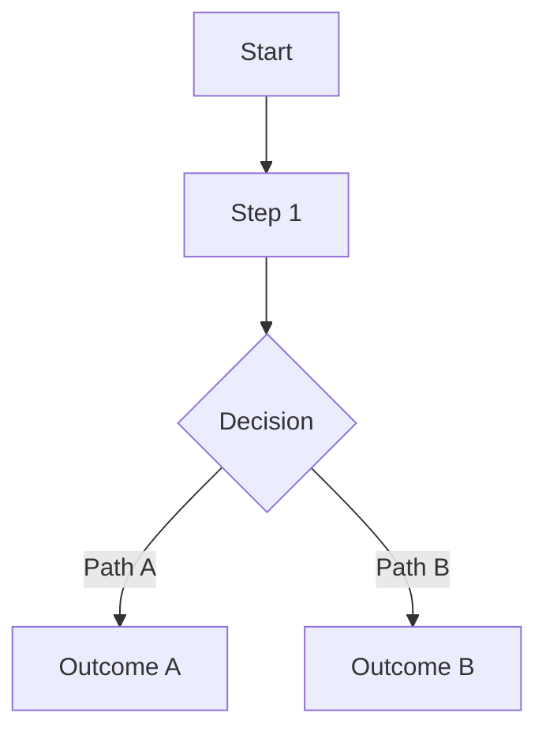

# Flow: <flow name>

## Objective

<Describe what this flow accomplishes and why it matters.>

## Entry Points

- 

## Actors

- 

## Related Modules

| Module | Documentation |
|---|---|
| | |

## Related Files

| Path | Role |
|---|---|
| | |

## Main Flow

## Alternative Flows

| Condition | Flow | Expected Outcome |
|---|---|---|
| | | |

## Error and Recovery Paths

| Error / Failure | Recovery | User Feedback |
|---|---|---|
| | | |

## Data and State Transitions

| State Before | Event | State After |
|---|---|---|
| | | |

## Validation Criteria

- 

## Known Risks

- 

## Change History

| Date | Version / Plan | Change |
|---|---|---|
| | | |
