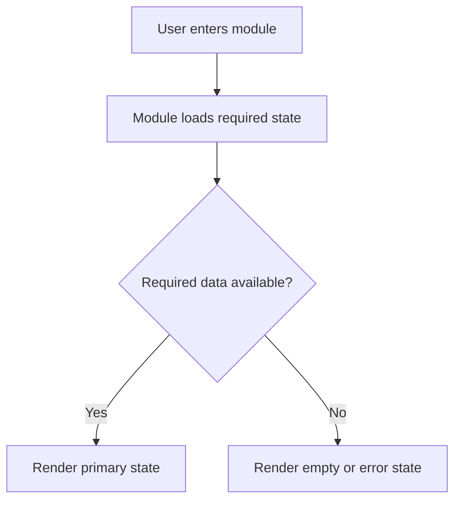

# Module: <module name>

## Objective

<Describe the module purpose and user value.>

## Related Files

| Path | Role |
|---|---|
| | |

## Related Pages / Components / Services

-

## Inputs

| Input | Source | Validation |
|---|---|---|
| | | |

## Outputs

| Output | Destination | Notes |
|---|---|---|
| | | |

## Business Rules

-

## Internal Dependencies

-

## External Dependencies

-

## User Events and Actions

| Event / Action | Expected Result |
|---|---|
| | |

## States

| State | Description | Trigger |
|---|---|---|
| Initial | | |
| Loading | | |
| Empty | | |
| Error | | |
| Success | | |

## Validation Criteria

-

## Known Risks

-

## Operating Flow

## Change History

| Date | Version / Plan | Change |
|---|---|---|
| | | |
