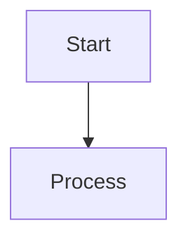

# Agent Skill: Obsidian Flavored Markdown Standardizer

---
name: obsidian-markdown
description: Standardize and edit Obsidian Flavored Markdown notes with wikilinks, embeds, callouts, properties, and double-bracket correlations. Use when working with .md files in the LLM Wiki (/wiki/), or when a plan requires structural note updates, formatting, or creating Obsidian semantic graph connections.
---

Standardize and create valid Obsidian Flavored Markdown to guarantee that the LLM Wiki in `/wiki/` scales as an absolute, connected semantic graph.

## 1. Operational Triggers
- Trigger 1: Creating or modifying any Markdown note in `/wiki/` (concepts, failures, releases, prompt patterns, decisions).
- Trigger 2: When validating the internal linking or cross-referencing between root guidelines and wiki notes.

## 2. Note Structure & Frontmatter (Properties)
Every wiki note must have a YAML block at the absolute top of the file containing the following properties:

```yaml
---
title: "Capitalized Descriptive Title"
type: "concept / synthesis / failure / pattern / decision / draft"
status: "pending / in_progress / validated / contradictory"
confidence: "low / medium / high"
last_reviewed: "YYYY-MM-DD"
related_version: "Vx.y.z"
tags:
  - "#category-tag"
  - "#secondary-tag"
---
```

## 3. Internal Semantic Links (Wikilinks)
Use bidirectional wikilinks to interconnect notes. This builds Obsidian's internal correlation graph:

```markdown
[[Note Name]]                          Link to note
[[Note Name|Display Text]]             Custom display text for link suggestion
[[Note Name#Heading]]                  Link to specific heading section in another note
[[Note Name#^block-id]]                Link to a specific block ID
[[#Heading in same note]]              Same-note heading link
```

*Rule: Place a block ID `^block-id` at the end of a block/paragraph to reference it directly elsewhere.*

## 4. Reusable Section Embeds (Transclusion)
Prefix wikilinks with `!` to dynamically embed other note sections inline without duplicating text:

```markdown
![[Note Name]]                         Embed entire note
![[Note Name#Heading]]                 Embed a specific section inline
![[image.png|width]]                   Embed image with optional width
```

## 5. Visual Callouts
Use standard callouts to highlight specific architectural notes, warnings, optimizations, or errors:

```markdown
> [!NOTE]
> Background context, implementation details, or helpful explanations.

> [!TIP]
> Performance optimizations, best practices, or efficiency suggestions.

> [!IMPORTANT]
> Essential requirements, critical steps, or must-know information.

> [!WARNING]
> Breaking changes, compatibility issues, or potential problems.

> [!CAUTION]
> High-risk actions that could cause data loss or security vulnerabilities.
```

Common foldable callout (- collapsed by default, + expanded by default):
```markdown
> [!FAQ]- Question Title
> Collapsed answer content.
```

## 6. Diagramming (Mermaid)
Always use mermaid code blocks for visual workflows:

To enable link clicks inside a Mermaid node, declare: `class NodeName internal-link;` at the bottom of the block.

## 7. Definition of Done Checklist for Notes
- [ ] Properties block is complete and valid YAML at the top.
- [ ] Heading hierarchy is logical and uses a single `# H1` matching the title.
- [ ] Internal vault connections use `[[wikilinks]]`. External connections use `[text](url)`.
- [ ] Highlights use `==double equal signs==`.
- [ ] No placeholder syntax remains.
