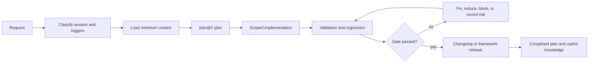

<a id="top"></a>

<div align="center">

# FrameCode VibeWork

**Markdown-First Declarative Governance for AI-Assisted Software Development**

Scoped planning · regression protection · selective context · controlled technical memory

[](https://buymeacoffee.com/hugomelovek)
[](LICENSE)
[](https://www.linkedin.com/in/hugoaraujo92/)
[](https://github.com/Sistema2D/FrameCode-VibeWork/releases/tag/v0.13.0)

Stable release **V0.13.0** · Documentation patch **V0.13.1 in preparation**

[](#pt-br)
[](#en-us)

</div>

---

<a id="pt-br"></a>

## Português (Brasil) · PT-BR

### Navegação

- [Visão geral](#pt-visao-geral)
- [Princípios e artefatos](#pt-principios)
- [Como começar](#pt-comecar)
- [Fluxo de uma mudança](#pt-fluxo)
- [Leitura seletiva](#pt-contexto)
- [Planos e regressões](#pt-regressoes)
- [Validação](#pt-validacao)
- [Skills, wiki e memória](#pt-conhecimento)
- [Automação declarativa](#pt-automacao)
- [Versões e releases](#pt-versoes)
- [Mapa do repositório](#pt-mapa)
- [Limites e estado atual](#pt-limites)

[Mudar para English (US)](#en-us) · [Voltar ao topo](#top)

<a id="pt-visao-geral"></a>

### Visão geral

FrameCode VibeWork (FCVW) é uma camada portátil de governança em Markdown para projetos desenvolvidos por pessoas e agentes de IA. Ele transforma uma solicitação em uma cadeia verificável de contexto, plano, execução, evidência, registro de versão e conhecimento reutilizável.

O framework reduz problemas recorrentes no desenvolvimento assistido:

- mudanças feitas sem escopo, evidência ou rollback;
- agentes que leem contexto insuficiente — ou o repositório inteiro sem necessidade;
- conclusão baseada apenas no novo comportamento, sem prova de não regressão;
- mistura entre políticas do framework, perfis do projeto e registros históricos;
- documentação, versão e implementação divergentes;
- memória de sessões sem curadoria;
- skills redundantes, específicas de fornecedor ou sem critério de saída;
- automações alegadas sem trigger, permissão, evidência ou política de falha.

O núcleo permanece legível sem runtime específico. O validador opcional usa somente a biblioteca padrão do Python para automatizar invariantes determinísticas; os documentos continuam sendo a fonte normativa.

[Navegação PT-BR](#pt-br) · [English (US)](#en-us) · [Topo](#top)

<a id="pt-principios"></a>

### Princípios e artefatos

1. **Escopo antes da mutação:** uma mudança versionada nasce em um plano.
2. **Contexto seletivo:** leia contratos acionados pelo evento e domínio, não todos os arquivos.
3. **Evidência antes da conclusão:** registre resultado observado, limitações e risco residual.
4. **Novo comportamento mais preservação:** prove o que mudou e o que continuou funcionando.
5. **Ownership explícito:** políticas, perfis, registros, templates e arquivos gerados evoluem de formas diferentes.
6. **História não é política atual:** registros explicam o passado; documentos canônicos definem o presente.
7. **Automação observável:** triggers, ações, permissões, falhas e rollback são declarados antes do adapter executável.
8. **Sem autoridade presumida:** commit, push, tag, publicação, deploy e ações destrutivas exigem autorização compatível.

| Papel | Representa | Exemplos | Atualização |
|---|---|---|---|
| `framework_policy` | regra genérica do FCVW | planejamento, testes, regressão | substituir com compatibilidade e migração |
| `framework_lock` | baseline FCVW instalada | [FRAMEWORK_LOCK.md](FCVW/FRAMEWORK_LOCK.md) | atualizar por mudança governada |
| `project_profile` | verdade específica da aplicação | escopo, stack, dados, ambiente | preencher e preservar |
| `record` | evidência histórica | planos, changelogs, ADRs, falhas | preservar; não sobrescrever em lote |
| `template` | modelo reutilizável vazio | `FCVW/governance/`, `FCVW/wiki/templates/` | substituir quando compatível com o schema |
| `generated` | navegação ou resumo derivado | filesystem e índices wiki | regenerar a partir do estado físico |
| `example` | demonstração não autoritativa | [minimal-change](FCVW/examples/minimal-change/README.md) | copiar e substituir placeholders |

Consulte [OWNERSHIP.md](FCVW/OWNERSHIP.md) e [SCHEMAS.md](FCVW/SCHEMAS.md) para os contratos completos.

[Navegação PT-BR](#pt-br) · [Topo](#top)

<a id="pt-comecar"></a>

### Como começar

#### Projeto novo

1. Leia [AGENTS.md](AGENTS.md), o entrypoint operacional.
2. Classifique a sessão em [CONTEXT_MAP.md](FCVW/CONTEXT_MAP.md).
3. Siga [INSTANTIATION.md](FCVW/INSTANTIATION.md) e execute o briefing necessário.
4. Preencha os arquivos `artifact_role: project_profile` apenas com fatos aprovados.
5. Defina a fonte de versão da aplicação em [MANIFEST.md](FCVW/MANIFEST.md) ou no runtime documentado.
6. Crie o primeiro plano `fcvw/plan@2` em `FCVW/Plans/pending/`.
7. Quando os perfis estiverem completos, execute o validador com `--profile instantiated`.

#### Aplicação existente

Use [RETROACTIVE_INSTANTIATION.md](FCVW/RETROACTIVE_INSTANTIATION.md). O fluxo inventaria o projeto, preserva código e histórico, classifica ownership e só então integra as políticas do FCVW. A adoção não autoriza refatoração ou limpeza destrutiva implícita.

#### Manutenção do próprio FCVW

Leia [FRAMEWORK_LOCK.md](FCVW/FRAMEWORK_LOCK.md), [OWNERSHIP.md](FCVW/OWNERSHIP.md), [MIGRATIONS.md](FCVW/MIGRATIONS.md) e o release alvo. Use planos com `record_scope: framework`, registre mudanças em `FCVW/framework-releases/` e valide com `clean-template`.

[Navegação PT-BR](#pt-br) · [Topo](#top)

<a id="pt-fluxo"></a>

### Fluxo de uma mudança


Para uma mudança versionada:

1. verifique planos relacionados em `pending/` e `in_progress/`;
2. crie ou retome um plano com objetivo, limites, risco, aceitação, impacto de regressão e rollback;
3. mova o plano para `in_progress` antes da implementação;
4. altere apenas os limites autorizados;
5. execute evidência proporcional ao risco e ao raio de dependência;
6. registre mudança da aplicação em `changelogs/` ou do FCVW em `framework-releases/`;
7. conclua o plano apenas sem resultado regressivo pendente ou gate bloqueante.

Consultas e análises somente leitura não exigem plano. Criar ou alterar arquivos depois da análise exige.

[Navegação PT-BR](#pt-br) · [Topo](#top)

<a id="pt-contexto"></a>

### Leitura seletiva

[CONTEXT_MAP.md](FCVW/CONTEXT_MAP.md) combina quatro fontes: tipo da sessão, `context_files` do plano ativo, eventos obrigatórios detectados e escalada justificada quando a evidência cruza outro domínio.

| Evento observado | Contratos adicionados |
|---|---|
| arquivo criado, movido ou removido | ownership e filesystem |
| API, CLI, formato ou fluxo público alterado | decisões arquiteturais, documentação e workflow |
| dependência, runtime ou serviço externo alterado | stack, ambiente e segurança |
| autenticação, permissão ou dado sensível | segurança, dados e testes |
| persistência ou migração | dados, testes e regressão |
| prompt, skill, agente, memória ou ferramenta de IA | AI, segurança e boundary replay |
| hook, watcher, daemon ou gate | automação e o contrato específico |
| versão, tag, artefato ou publicação | versionamento, release e checklist |
| fechamento ou handoff | auditoria, regressão, memória e estado do plano |

Documentos longos possuem rotas por seção. Se nenhum cenário corresponder, use o fallback do mapa; carregar toda a wiki ou todos os planos não é o fallback. O validador bloqueia políticas órfãs e tipos de sessão de skills sem rota.

[Navegação PT-BR](#pt-br) · [Topo](#top)

<a id="pt-regressoes"></a>

### Planos e regressões

Planos atuais usam `fcvw/plan@2` e registram:

- comportamentos existentes possivelmente afetados;
- contratos consultados;
- checks de preservação selecionados;
- evidência final;
- limitações e risco residual.

`regression_contract: not_applicable` exige justificativa específica e não elimina validações estruturais aplicáveis. Planos históricos `fcvw/plan@1` permanecem legíveis e só migram quando substantivamente reabertos.

Consulte [REGRESSION_GUARDS.md](FCVW/REGRESSION_GUARDS.md) para blockers e [TESTS.md](FCVW/TESTS.md) para evidência proporcional ao risco. Regressões confirmadas e reutilizáveis usam `fcvw/regression@1`.

[Navegação PT-BR](#pt-br) · [Topo](#top)

<a id="pt-validacao"></a>

### Validação

```powershell
python -m py_compile tools/validate_fcvw.py tools/test_validate_fcvw.py
python tools/test_validate_fcvw.py
python tools/validate_fcvw.py --root . --profile clean-template
```

Depois de instanciar os perfis da aplicação:

```powershell
python tools/validate_fcvw.py --root . --profile instantiated
```

Durante migração com dívida legada revisada:

```powershell
python tools/validate_fcvw.py --root . --profile incremental --baseline path/to/legacy-baseline.md
```

| Perfil | Uso |
|---|---|
| `clean-template` | permite placeholders somente nos papéis apropriados e bloqueia contaminação |
| `instantiated` | exige perfis completos e sem placeholders pendentes |
| `incremental` | bloqueia dívida nova e separa achados cobertos por baseline exato e temporário |
| `strict` | trata todo achado aplicável como bloqueante |

O validador cobre caminhos, metadados, links, fences Markdown, planos, regressões, skills, rotas, wiki, ownership, contaminação e versões. Ele não substitui testes da aplicação, análise jurídica ou revisão humana de alto risco.

[Navegação PT-BR](#pt-br) · [Topo](#top)

<a id="pt-conhecimento"></a>

### Skills, wiki e memória

Os 21 skills em `FCVW/skills/` são procedimentos just-in-time. Cada um declara triggers, tipos de sessão, propósito, limites, inputs, procedimento, output e critérios de saída. O [catálogo de skills](FCVW/skills/README.md) é a fonte de descoberta.

- novos skills ou agentes passam por `agent-factory`;
- alterações em assets existentes passam por `self-improvement`;
- o core permanece independente de fornecedor;
- skills não ampliam o escopo do plano.

[MEMORY.md](FCVW/MEMORY.md) separa contexto ativo, conhecimento curado e arquivo pesquisável. A wiki guarda conhecimento reutilizável e com fontes, não uma cópia de toda sessão. Use `wiki-curator` para promoção e deduplicação e `wiki-lint` para integridade.

[Navegação PT-BR](#pt-br) · [Topo](#top)

<a id="pt-automacao"></a>

### Automação declarativa

[AUTOMATION.md](FCVW/AUTOMATION.md) define três cenários:

| Cenário | Significado |
|---|---|
| 1 | contratos somente Markdown, avaliados por pessoa ou agente autorizado |
| 2 | adapter local opcional, habilitado explicitamente pelo projeto |
| 3 | CI, scheduler ou serviço externo com autorização e evidência próprias |

Os tipos são [hooks](FCVW/HOOKS.md), [watchers](FCVW/WATCHERS.md), [daemons](FCVW/DAEMONS.md) e [governance gates](FCVW/GOVERNANCE_GATES.md). Um contrato não prova que um processo esteja rodando. Uma implementação executável precisa de trigger, precondições, ações, evidência, retry, timeout, permissões, failure policy e rollback.

[Navegação PT-BR](#pt-br) · [Topo](#top)

<a id="pt-versoes"></a>

### Versões e releases

FCVW separa dois namespaces:

- **aplicação:** `FCVW/changelogs/Vx.y.z.md` e a fonte de versão do produto;
- **framework:** `FCVW/framework-releases/Vx.y.z.md` e [FRAMEWORK_LOCK.md](FCVW/FRAMEWORK_LOCK.md).

A release estável atual é [V0.13.0](https://github.com/Sistema2D/FrameCode-VibeWork/releases/tag/v0.13.0), com pacote limpo e SHA-256 publicados. O patch documental [V0.13.1](FCVW/framework-releases/V0.13.1.md) está **in preparation** e não possui tag ou release.

Uma mudança do FCVW não incrementa a versão da aplicação. `published` só é usado após publicação real; tag, push, deploy e release externo exigem autoridade e evidência separadas.

[Navegação PT-BR](#pt-br) · [Topo](#top)

<a id="pt-mapa"></a>

### Mapa do repositório

| Caminho | Responsabilidade |
|---|---|
| [AGENTS.md](AGENTS.md) | ordem operacional, mudanças, leitura e fechamento |
| `.cursorrules`, `.windsurfrules` | bridges opcionais que encaminham para `AGENTS.md` |
| [FCVW/README.md](FCVW/README.md) | índice canônico do framework |
| [FCVW/CONTEXT_MAP.md](FCVW/CONTEXT_MAP.md) | rotas por sessão, evento, seção e tipo de skill |
| [FCVW/PLANNING.md](FCVW/PLANNING.md) | schema e lifecycle de planos |
| [FCVW/REGRESSION_GUARDS.md](FCVW/REGRESSION_GUARDS.md) | preservação de comportamento e Regression gate |
| [FCVW/TESTS.md](FCVW/TESTS.md) | evidência proporcional ao risco |
| [FCVW/OWNERSHIP.md](FCVW/OWNERSHIP.md) | substituir, preservar, mesclar ou regenerar |
| [FCVW/SCHEMAS.md](FCVW/SCHEMAS.md) | contratos verificáveis e compatibilidade |
| [FCVW/MIGRATIONS.md](FCVW/MIGRATIONS.md) | upgrade sem sobrescrever o projeto |
| `FCVW/Plans/` | fila e histórico de mudanças governadas |
| `FCVW/changelogs/` | releases da aplicação |
| `FCVW/framework-releases/` | releases do FCVW |
| `FCVW/governance/` | templates reutilizáveis |
| `FCVW/wiki/` | memória técnica, regressões e índices |
| `FCVW/skills/` | procedimentos sob demanda |
| `FCVW/refactoring-guide/` | técnicas e gates de refatoração |
| [tools/validate_fcvw.py](tools/validate_fcvw.py) | validador determinístico opcional |
| [tools/test_validate_fcvw.py](tools/test_validate_fcvw.py) | testes de regressão do validador |

[FILESYSTEM.md](FCVW/FILESYSTEM.md) resume o contrato físico; o disco é a fonte de verdade para existência de arquivos.

[Navegação PT-BR](#pt-br) · [Topo](#top)

<a id="pt-limites"></a>

### Limites e estado atual

FCVW não é um runtime de agentes, IDE, banco de dados, substituto de testes/CI/revisão humana ou autorização automática para modificar sistemas externos. Também não garante que um adapter externo respeitará instruções Markdown.

O template limpo contém políticas, perfis vazios, templates, skills e registros do próprio desenvolvimento do framework. Não contém credenciais, dados de produção, screenshots, histórico de aplicação ou fixtures derivadas de aplicações reais.

V0.13 introduziu ownership e migração seletiva, schemas `plan@2` e `regression@1`, namespaces separados, guardrails de regressão, memória não destrutiva, IDs seguros para concorrência, skills independentes de fornecedor, automação observável e validação de rotas/políticas órfãs.

[Mudar para English (US)](#en-us) · [Navegação PT-BR](#pt-br) · [Topo](#top)

---

<a id="en-us"></a>

## English (United States) · ENG-US

### Navigation

- [Overview](#en-overview)
- [Principles and artifacts](#en-principles)
- [Getting started](#en-getting-started)
- [Change lifecycle](#en-lifecycle)
- [Selective context](#en-context)
- [Plans and regressions](#en-regressions)
- [Validation](#en-validation)
- [Skills, wiki, and memory](#en-knowledge)
- [Declarative automation](#en-automation)
- [Versions and releases](#en-versions)
- [Repository map](#en-map)
- [Limits and current state](#en-limits)

[Mudar para Português (Brasil)](#pt-br) · [Back to top](#top)

<a id="en-overview"></a>

### Overview

FrameCode VibeWork (FCVW) is a portable Markdown governance layer for projects developed by people and AI agents. It turns a request into a verifiable chain of context, planning, scoped execution, evidence, version records, and reusable knowledge.

The framework reduces recurring problems in AI-assisted development:

- changes made without scope, evidence, or rollback;
- agents reading too little context—or the entire repository without need;
- completion based only on new behavior, without regression evidence;
- framework policy, project profiles, and historical records being mixed together;
- documentation, version, and implementation drift;
- uncurated session memory;
- redundant, provider-specific, or open-ended skills;
- claimed automation without triggers, permissions, evidence, or failure policy.

The core remains readable without a specific runtime. The optional validator uses only the Python standard library to automate deterministic invariants; Markdown documents remain normative.

[ENG-US navigation](#en-us) · [Português (Brasil)](#pt-br) · [Top](#top)

<a id="en-principles"></a>

### Principles and artifacts

1. **Scope before mutation:** every versioned change begins with a plan.
2. **Selective context:** read contracts triggered by the event and domain, not every file.
3. **Evidence before completion:** record observed results, limitations, and residual risk.
4. **New behavior plus preservation:** prove what changed and what kept working.
5. **Explicit ownership:** policies, profiles, records, templates, and generated files evolve differently.
6. **History is not current policy:** records explain the past; canonical documents define the present.
7. **Observable automation:** triggers, actions, permissions, failures, and rollback are declared before an executable adapter.
8. **No presumed authority:** commits, pushes, tags, publication, deployments, and destructive actions require compatible authorization.

| Role | Represents | Examples | Update rule |
|---|---|---|---|
| `framework_policy` | generic FCVW rule | planning, tests, regression | replace with compatibility and migration |
| `framework_lock` | installed FCVW baseline | [FRAMEWORK_LOCK.md](FCVW/FRAMEWORK_LOCK.md) | update through a governed change |
| `project_profile` | application-specific truth | scope, stack, data, environment | populate and preserve |
| `record` | historical evidence | plans, changelogs, ADRs, failures | preserve; never bulk-overwrite |
| `template` | empty reusable model | `FCVW/governance/`, `FCVW/wiki/templates/` | replace when schema-compatible |
| `generated` | derived navigation or summary | filesystem and wiki indexes | regenerate from physical state |
| `example` | non-authoritative demonstration | [minimal-change](FCVW/examples/minimal-change/README.md) | copy and replace placeholders |

See [OWNERSHIP.md](FCVW/OWNERSHIP.md) and [SCHEMAS.md](FCVW/SCHEMAS.md) for the complete contracts.

[ENG-US navigation](#en-us) · [Top](#top)

<a id="en-getting-started"></a>

### Getting started

#### New project

1. Read [AGENTS.md](AGENTS.md), the operational entrypoint.
2. Classify the session through [CONTEXT_MAP.md](FCVW/CONTEXT_MAP.md).
3. Follow [INSTANTIATION.md](FCVW/INSTANTIATION.md) and complete the necessary briefing.
4. Populate `artifact_role: project_profile` files only with approved facts.
5. Define the application version source in [MANIFEST.md](FCVW/MANIFEST.md) or the documented runtime.
6. Create the first `fcvw/plan@2` under `FCVW/Plans/pending/`.
7. When profiles are complete, run the validator with `--profile instantiated`.

#### Existing application

Use [RETROACTIVE_INSTANTIATION.md](FCVW/RETROACTIVE_INSTANTIATION.md). The flow inventories the project, preserves code and history, classifies ownership, and only then integrates FCVW policies. Adoption does not implicitly authorize refactoring or destructive cleanup.

#### Maintaining FCVW itself

Read [FRAMEWORK_LOCK.md](FCVW/FRAMEWORK_LOCK.md), [OWNERSHIP.md](FCVW/OWNERSHIP.md), [MIGRATIONS.md](FCVW/MIGRATIONS.md), and the target release. Use plans with `record_scope: framework`, record changes under `FCVW/framework-releases/`, and validate with `clean-template`.

[ENG-US navigation](#en-us) · [Top](#top)

<a id="en-lifecycle"></a>

### Change lifecycle



For a versioned change:

1. inspect related plans under `pending/` and `in_progress/`;
2. create or resume a plan with objective, limits, risk, acceptance, regression impact, and rollback;
3. move the plan to `in_progress` before implementation;
4. modify only authorized boundaries;
5. collect evidence proportional to risk and dependency radius;
6. record application changes in `changelogs/` or FCVW changes in `framework-releases/`;
7. complete the plan only when no regression result is pending and no blocking gate remains.

Read-only queries and analyses do not require a plan. Creating or changing files after the analysis does.

[ENG-US navigation](#en-us) · [Top](#top)

<a id="en-context"></a>

### Selective context

[CONTEXT_MAP.md](FCVW/CONTEXT_MAP.md) combines four sources: session type, the active plan's `context_files`, detected mandatory events, and justified escalation when evidence crosses another domain.

| Observed event | Additional contracts |
|---|---|
| file created, moved, or removed | ownership and filesystem |
| public API, CLI, format, or workflow changed | architectural decisions, documentation, and workflow |
| dependency, runtime, or external service changed | stack, environment, and security |
| authentication, permission, or sensitive data | security, data, and tests |
| persistence or migration | data, tests, and regression |
| AI prompt, skill, agent, memory, or tool | AI, security, and boundary replay |
| hook, watcher, daemon, or gate | automation and the specific contract |
| version, tag, artifact, or publication | versioning, release, and checklist |
| closeout or handoff | audit, regression, memory, and plan state |

Long documents have section-level routes. If no scenario matches, use the map's fallback; loading the entire wiki or every plan is not the fallback. The validator blocks orphan policies and skill session types without routes.

[ENG-US navigation](#en-us) · [Top](#top)

<a id="en-regressions"></a>

### Plans and regressions

Current plans use `fcvw/plan@2` and record:

- existing behaviors that may be affected;
- consulted contracts;
- selected preservation checks;
- final evidence;
- limitations and residual risk.

`regression_contract: not_applicable` requires a specific justification and does not remove applicable structural validation. Historical `fcvw/plan@1` files remain readable and migrate only when substantively reopened.

See [REGRESSION_GUARDS.md](FCVW/REGRESSION_GUARDS.md) for blockers and [TESTS.md](FCVW/TESTS.md) for risk-proportional evidence. Confirmed reusable regressions use `fcvw/regression@1`.

[ENG-US navigation](#en-us) · [Top](#top)

<a id="en-validation"></a>

### Validation

```powershell
python -m py_compile tools/validate_fcvw.py tools/test_validate_fcvw.py
python tools/test_validate_fcvw.py
python tools/validate_fcvw.py --root . --profile clean-template
```

After application profiles are instantiated:

```powershell
python tools/validate_fcvw.py --root . --profile instantiated
```

During a migration with reviewed legacy debt:

```powershell
python tools/validate_fcvw.py --root . --profile incremental --baseline path/to/legacy-baseline.md
```

| Profile | Use |
|---|---|
| `clean-template` | allows placeholders only in appropriate roles and blocks contamination |
| `instantiated` | requires complete profiles without unresolved placeholders |
| `incremental` | blocks new debt and separates exact, temporary legacy-baseline findings |
| `strict` | treats every applicable finding as blocking |

The validator covers paths, metadata, links, Markdown fences, plans, regressions, skills, routes, wiki, ownership, contamination, and versions. It does not replace application tests, legal analysis, or high-risk human review.

[ENG-US navigation](#en-us) · [Top](#top)

<a id="en-knowledge"></a>

### Skills, wiki, and memory

The 21 skills under `FCVW/skills/` are just-in-time procedures. Each declares triggers, session types, purpose, boundaries, inputs, procedure, output, and exit criteria. The [skills catalog](FCVW/skills/README.md) is the discovery source.

- new skills or agents go through `agent-factory`;
- changes to existing assets go through `self-improvement`;
- the core remains provider-neutral;
- skills never expand the plan's scope.

[MEMORY.md](FCVW/MEMORY.md) separates active context, curated knowledge, and searchable archives. The wiki stores reusable, sourced knowledge rather than a copy of every session. Use `wiki-curator` for promotion and deduplication and `wiki-lint` for integrity.

[ENG-US navigation](#en-us) · [Top](#top)

<a id="en-automation"></a>

### Declarative automation

[AUTOMATION.md](FCVW/AUTOMATION.md) defines three scenarios:

| Scenario | Meaning |
|---|---|
| 1 | Markdown-only contracts evaluated by an authorized person or agent |
| 2 | optional local adapter explicitly enabled by the project |
| 3 | CI, scheduler, or external service with its own authorization and evidence |

Contract types are [hooks](FCVW/HOOKS.md), [watchers](FCVW/WATCHERS.md), [daemons](FCVW/DAEMONS.md), and [governance gates](FCVW/GOVERNANCE_GATES.md). A contract does not prove that a process is running. Executable implementations need a trigger, preconditions, actions, evidence, retry, timeout, permissions, failure policy, and rollback.

[ENG-US navigation](#en-us) · [Top](#top)

<a id="en-versions"></a>

### Versions and releases

FCVW separates two namespaces:

- **application:** `FCVW/changelogs/Vx.y.z.md` and the product version source;
- **framework:** `FCVW/framework-releases/Vx.y.z.md` and [FRAMEWORK_LOCK.md](FCVW/FRAMEWORK_LOCK.md).

The current stable release is [V0.13.0](https://github.com/Sistema2D/FrameCode-VibeWork/releases/tag/v0.13.0), with a published clean package and SHA-256. Documentation patch [V0.13.1](FCVW/framework-releases/V0.13.1.md) is **in preparation** and has no tag or release.

An FCVW change does not increment an application's version. `published` is used only after real publication; tags, pushes, deployments, and external releases require separate authority and evidence.

[ENG-US navigation](#en-us) · [Top](#top)

<a id="en-map"></a>

### Repository map

| Path | Responsibility |
|---|---|
| [AGENTS.md](AGENTS.md) | operating order, changes, reading, and closeout |
| `.cursorrules`, `.windsurfrules` | optional bridges pointing tools to `AGENTS.md` |
| [FCVW/README.md](FCVW/README.md) | canonical framework index |
| [FCVW/CONTEXT_MAP.md](FCVW/CONTEXT_MAP.md) | session, event, section, and skill-type routes |
| [FCVW/PLANNING.md](FCVW/PLANNING.md) | plan schema and lifecycle |
| [FCVW/REGRESSION_GUARDS.md](FCVW/REGRESSION_GUARDS.md) | behavior preservation and Regression gate |
| [FCVW/TESTS.md](FCVW/TESTS.md) | risk-proportional evidence |
| [FCVW/OWNERSHIP.md](FCVW/OWNERSHIP.md) | replace, preserve, merge, or regenerate |
| [FCVW/SCHEMAS.md](FCVW/SCHEMAS.md) | machine-checkable contracts and compatibility |
| [FCVW/MIGRATIONS.md](FCVW/MIGRATIONS.md) | upgrades without overwriting the project |
| `FCVW/Plans/` | governed change queue and history |
| `FCVW/changelogs/` | application releases |
| `FCVW/framework-releases/` | FCVW releases |
| `FCVW/governance/` | reusable templates |
| `FCVW/wiki/` | technical memory, regressions, and indexes |
| `FCVW/skills/` | on-demand procedures |
| `FCVW/refactoring-guide/` | refactoring techniques and gates |
| [tools/validate_fcvw.py](tools/validate_fcvw.py) | optional deterministic validator |
| [tools/test_validate_fcvw.py](tools/test_validate_fcvw.py) | validator regression tests |

[FILESYSTEM.md](FCVW/FILESYSTEM.md) summarizes the physical contract; disk is the source of truth for file existence.

[ENG-US navigation](#en-us) · [Top](#top)

<a id="en-limits"></a>

### Limits and current state

FCVW is not an agent runtime, IDE, database, substitute for tests/CI/human review, or automatic authorization to modify external systems. It also cannot guarantee that an external adapter will honor Markdown instructions.

The clean template contains policies, empty project profiles, templates, skills, and records of the framework's own development. It contains no credentials, production data, screenshots, application history, or fixtures derived from real applications.

V0.13 introduced ownership-aware migration, `plan@2` and `regression@1` schemas, separate version namespaces, regression guardrails, non-destructive memory, concurrency-safe IDs, provider-neutral skills, observable automation, and orphan-policy/reading-route validation.

[Mudar para Português (Brasil)](#pt-br) · [ENG-US navigation](#en-us) · [Top](#top)

---

<div align="center">

Stable: [V0.13.0](https://github.com/Sistema2D/FrameCode-VibeWork/releases/tag/v0.13.0) · Next: [V0.13.1](FCVW/framework-releases/V0.13.1.md) in preparation

[Apache License 2.0](LICENSE) · [Attribution / Atribuição](NOTICE) · [LinkedIn](https://www.linkedin.com/in/hugoaraujo92/) · [Buy Me a Coffee](https://buymeacoffee.com/hugomelovek)

[PT-BR](#pt-br) · [ENG-US](#en-us) · [Top](#top)

</div>
