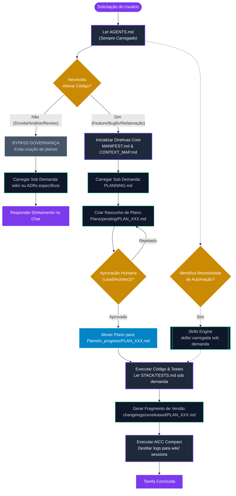
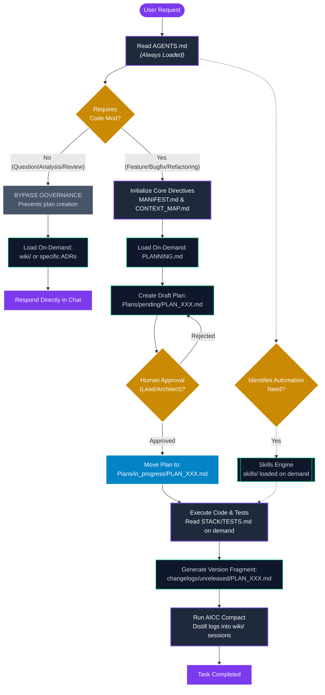

*Selecione o Idioma / Select Language:*
- [Português](#português)
- [English](#english)

---

## Português

[](https://www.buymeacoffee.com/hugomelovek)

> [!NOTE]
> ### 🛠️ Governança Assistida por IA (FrameCode VibeWork)
> Este projeto é regido pelo framework de governança documental e memória técnica **FrameCode VibeWork (FCVW)**, localizado integralmente na pasta `/FCVW`.
>
> Quando trabalhar com assistentes de IA (como Cursor, Windsurf ou agentes agentizados):
> * O agente lerá automaticamente o arquivo `./AGENTS.md` na raiz.
> * O agente utilizará a governança, planos e base de conhecimento dentro de `./FCVW/`.

### Estrutura do Repositório

```text
[project-root]/
├── 📁 src/                  # Código-fonte principal da sua aplicação (React, Node, Python, etc.)
├── 📁 public/               # Ativos estáticos públicos do seu sistema
├── 📄 package.json          # Configuração de pacotes e scripts da sua aplicação
├── 📄 .gitignore            # Filtros de versionamento do Git
├── 📄 README.md             # Este arquivo (descreve a sua aplicação)
├── 📄 AGENTS.md             # Ponte de instrução e regras para os agentes de IA
├── 📄 .cursorrules          # Regras operacionais para o Cursor IDE
├── 📄 .windsurfrules        # Regras operacionais para o Windsurf IDE
└── 📂 FCVW/                 # Subpasta contendo o motor do framework VibeWork
    ├── 📄 README.md         # Documentação original do framework VibeWork
    ├── 📄 STACK.md          # Arquitetura técnica e stack do projeto
    ├── 📄 SCOPE.md          # Limites funcionais e escopo do produto
    ├── 📄 ENVIRONMENT.md    # Governança de ambiente e segredos
    ├── 📄 PERFORMANCE.md    # Governança e orçamentos de desempenho
    ├── 📂 Plans/            # Planos de alteração e ciclo de vida
    ├── 📂 wiki/             # Memória técnica incremental do projeto (LLM Wiki)
    └── 📂 skills/           # Motor de habilidades avançadas e agentes autônomos
```

### Fluxo Operacional e Roteamento de Cenários

O FCVW não sobrecarrega a janela de contexto carregando todos os arquivos o tempo todo. Ele adota um fluxo de decisões inteligente e **ingestão sob demanda** de capacidades e arquivos de suporte:



#### 📌 Regras de Ingestão de Arquivos (Context Ingestion Rules)

1. **Sempre Carregados (Always Loaded):**
   - [AGENTS.md](file:///c:/Users/meloha/Desktop/AGENTES/FrameCode-VibeWork/AGENTS.md): Gancho de contexto inicial da IDE.
   - [FCVW/MANIFEST.md](file:///c:/Users/meloha/Desktop/AGENTES/FrameCode-VibeWork/FCVW/MANIFEST.md): Regras fundamentais e pilares inegociáveis de arquitetura.
   - [FCVW/CONTEXT_MAP.md](file:///c:/Users/meloha/Desktop/AGENTES/FrameCode-VibeWork/FCVW/CONTEXT_MAP.md): Router e limites do mapa de escopos.

2. **Sob Demanda (On-Demand / Conditional):**
   - **`Plans/` e `PLANNING.md`:** Apenas quando há modificações físicas de código em andamento.
   - **`changelogs/` e `VERSIONING.md`:** Apenas no encerramento da tarefa e ciclo de release.
   - **`wiki/` e ADRs:** Apenas durante a pesquisa de conceitos específicos ou consolidação de fim de sessão (AICC Compact).
   - **`skills/`:** Ativadas apenas sob comando específico de IA (ex: linting, empacotamento, auditoria profunda).
   - **Documentos de Suporte** (ex: `TESTS.md`, `SECURITY.md`, `PERFORMANCE.md`): Ingeridos somente se o plano ativo listar alterações nestas subáreas.


### Como Começar

#### 1. Requisitos
* Um editor de código moderno com suporte a assistentes de IA (ex: Cursor, Windsurf, VS Code).
* Copiar o arquivo `AGENTS.md` para a raiz do seu projeto.
* Manter o diretório `/FCVW` íntegro na estrutura de pastas.

#### 2. Fluxo Inicial de Uso
1. **Defina o Contexto:** Descreva as metas e restrições iniciais em `FCVW/BRIEFING.md`.
2. **Configure as Regras:** Personalize o `FCVW/MANIFEST.md` com os princípios e arquitetura inegociáveis do seu projeto.
3. **Inicie o Desenvolvimento:** Oriente seu assistente de IA a ler `AGENTS.md` e seguir estritamente o ciclo de governança do framework.


### Gestão de Conhecimento e Obsidian

Para visualizar os gráficos de decisão, o histórico de versões formais, relatórios de troubleshooting e padrões arquiteturais do seu projeto:
1. Abra o aplicativo **Obsidian**.
2. Escolha **"Open folder as vault"** (Abrir pasta como cofre).
3. Selecione a subpasta `/FCVW` na raiz deste projeto.
4. Agora você pode navegar pelos planos, conceitos e conexões em um gráfico interativo completo!

*Este repositório foi organizado com amor usando o ecossistema assistido do FrameCode VibeWork.*

---

## English

[](https://www.buymeacoffee.com/hugomelovek)

> [!NOTE]
> ### 🛠️ AI-Assisted Governance (FrameCode VibeWork)
> This project is governed by the **FrameCode VibeWork (FCVW)** document governance and technical memory framework, located entirely in the `/FCVW` folder.
>
> When working with AI assistants (such as Cursor, Windsurf, or agentic workflows):
> * The agent will automatically read the `./AGENTS.md` file at the root.
> * The agent will utilize the governance, plans, and knowledge base within `./FCVW/`.

### Repository Structure

```text
[project-root]/
├── 📁 src/                  # Main source code of your application (React, Node, Python, etc.)
├── 📁 public/               # Public static assets of your system
├── 📄 package.json          # Package and scripts configuration for your app
├── 📄 .gitignore            # Git versioning filters
├── 📄 README.md             # This file (describes your application)
├── 📄 AGENTS.md             # Instruction bridge and rules for AI agents
├── 📄 .cursorrules          # Operational rules for the Cursor IDE
├── 📄 .windsurfrules        # Operational rules for the Windsurf IDE
└── 📂 FCVW/                 # Subfolder containing the VibeWork framework engine
    ├── 📄 README.md         # Original VibeWork framework documentation
    ├── 📄 STACK.md          # Technical architecture and project stack
    ├── 📄 SCOPE.md          # Functional boundaries and product scope
    ├── 📄 ENVIRONMENT.md    # Environment and secrets governance
    ├── 📄 PERFORMANCE.md    # Performance budgets and governance
    ├── 📂 Plans/            # Change plans and lifecycle management
    ├── 📂 wiki/             # Incremental technical memory of the project (LLM Wiki)
    └── 📂 skills/           # Advanced skills engine and autonomous agents
```

### Operational Flow and Scenario Routing

FCVW does not overload the context window by loading all files at all times. It implements an intelligent decision tree and **on-demand ingestion** of capabilities and support files:



#### 📌 Context Ingestion Rules

1. **Always Loaded:**
   - [AGENTS.md](file:///c:/Users/meloha/Desktop/AGENTES/FrameCode-VibeWork/AGENTS.md): Initial IDE context hook.
   - [FCVW/MANIFEST.md](file:///c:/Users/meloha/Desktop/AGENTES/FrameCode-VibeWork/FCVW/MANIFEST.md): Fundamental rules and non-negotiable architectural pillars.
   - [FCVW/CONTEXT_MAP.md](file:///c:/Users/meloha/Desktop/AGENTES/FrameCode-VibeWork/FCVW/CONTEXT_MAP.md): Router and boundary of scopes.

2. **On-Demand (Conditional):**
   - **`Plans/` and `PLANNING.md`:** Ingested only when physical code changes are active.
   - **`changelogs/` and `VERSIONING.md`:** Loaded only at task closure and release cycles.
   - **`wiki/` and ADRs:** Read/written only during research of specific concepts or session consolidation (AICC Compact).
   - **`skills/`:** Triggered only under specific AI commands (e.g. linting, packaging, deep audits).
   - **Support Documents** (e.g., `TESTS.md`, `SECURITY.md`, `PERFORMANCE.md`): Loaded only if the active plan touches these specific subareas.


### Getting Started

#### 1. Requirements
* A modern code editor with support for AI assistants (e.g., Cursor, Windsurf, VS Code).
* Copy the `AGENTS.md` file to the root of your project.
* Maintain the integrity of the `/FCVW` directory in your project's folder structure.

#### 2. Initial Workflow
1. **Define the Context:** Write down the initial goals and constraints in `FCVW/BRIEFING.md`.
2. **Configure the Rules:** Customize `FCVW/MANIFEST.md` with the non-negotiable principles and architecture of your project.
3. **Start Developing:** Instruct your AI assistant to read `AGENTS.md` and strictly follow the framework's governance cycle.


### Knowledge Management and Obsidian

To visualize decision graphs, formal version history, troubleshooting reports, and architectural patterns of your project:
1. Open the **Obsidian** app.
2. Choose **"Open folder as vault"**.
3. Select the `/FCVW` subfolder at the root of this project.
4. You can now navigate through plans, concepts, and connections in a fully interactive graph!

*This repository was lovingly organized using the FrameCode VibeWork assisted ecosystem.*

---

### Star History

[](https://star-history.com/#Sistema2D/FrameCode-VibeWork&Date)

