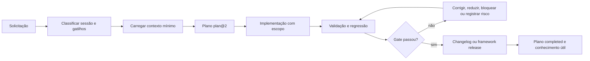

<div align="center">

# FrameCode VibeWork

**Governança Markdown-first para desenvolvimento assistido por IA**

Planejamento rastreável · execução com escopo · proteção contra regressões · memória técnica controlada

Framework **V0.13.0** · estado **published** · licença **Apache-2.0**

</div>

## Navegação

- [O que é](#o-que-é)
- [Como o framework pensa](#como-o-framework-pensa)
- [Como começar](#como-começar)
- [Fluxo de uma mudança](#fluxo-de-uma-mudança)
- [Leitura seletiva de contexto](#leitura-seletiva-de-contexto)
- [Planos e regressões](#planos-e-regressões)
- [Validação](#validação)
- [Skills, wiki e memória](#skills-wiki-e-memória)
- [Automação declarativa](#automação-declarativa)
- [Versões e releases](#versões-e-releases)
- [Mapa do repositório](#mapa-do-repositório)
- [Limites e estado atual](#limites-e-estado-atual)
- [English orientation](#english-orientation)

## O que é

FrameCode VibeWork (FCVW) é uma camada de governança portátil para projetos desenvolvidos por pessoas e agentes de IA. Ele transforma uma solicitação em uma cadeia verificável de contexto, plano, execução, evidência, registro de versão e conhecimento reutilizável.

O framework existe para reduzir problemas comuns em desenvolvimento assistido:

- mudanças feitas sem escopo ou sem rollback;
- agentes que leem contexto insuficiente — ou todo o repositório sem necessidade;
- conclusão baseada apenas no novo comportamento, sem prova de não regressão;
- mistura entre políticas do framework e dados da aplicação;
- documentação, versão e implementação divergentes;
- memória de sessões crescendo sem curadoria;
- skills redundantes, específicas de fornecedor ou sem critério de saída;
- automações alegadas sem trigger, permissão, evidência ou política de falha.

O núcleo é Markdown e permanece legível sem runtime específico. O validador opcional usa somente a biblioteca padrão do Python e automatiza invariantes determinísticas; os documentos continuam sendo a fonte normativa.

## Como o framework pensa

### Princípios

1. **Escopo antes da mutação:** uma mudança versionada nasce em um plano.
2. **Contexto seletivo:** leia os contratos acionados pelo evento e pelo domínio, não todos os arquivos.
3. **Evidência antes da conclusão:** registre resultado observado, limitações e risco residual.
4. **Novo comportamento mais preservação:** uma mudança prova o que passou a funcionar e o que continuou funcionando.
5. **Ownership explícito:** políticas, perfis da aplicação, registros, templates e arquivos gerados têm regras diferentes de atualização.
6. **História não é política atual:** planos, sessões e falhas são evidência; documentos canônicos definem o estado vigente.
7. **Automação observável:** triggers, ações, permissões, falhas e rollback são declarados antes de qualquer adapter executável.
8. **Sem autoridade presumida:** commit, push, tag, publicação, deploy e ação destrutiva exigem escopo ou autorização compatível.

### Modelo de artefatos

| Papel | O que representa | Exemplos | Regra de atualização |
|---|---|---|---|
| `framework_policy` | regra genérica do FCVW | planejamento, testes, regressão, release | substituir somente com migração compatível |
| `framework_lock` | baseline FCVW instalada | [FRAMEWORK_LOCK.md](FCVW/FRAMEWORK_LOCK.md) | atualizar por migração governada |
| `project_profile` | verdade específica da aplicação | escopo, stack, dados, ambiente, design | preencher e preservar |
| `record` | evidência histórica | planos, changelogs, ADRs, falhas | preservar; não sobrescrever em lote |
| `template` | modelo reutilizável vazio | `FCVW/governance/`, `FCVW/wiki/templates/` | substituir quando schema-compatible |
| `generated` | índice ou resumo derivado | filesystem, índice e métricas wiki | regenerar a partir do estado físico |
| `example` | demonstração não autoritativa | [minimal-change](FCVW/examples/minimal-change/README.md) | copiar e substituir todos os placeholders |

As regras completas estão em [OWNERSHIP.md](FCVW/OWNERSHIP.md) e [SCHEMAS.md](FCVW/SCHEMAS.md).

## Como começar

### 1. Projeto novo a partir do template limpo

1. Leia [AGENTS.md](AGENTS.md), o entrypoint operacional.
2. Classifique a sessão usando [CONTEXT_MAP.md](FCVW/CONTEXT_MAP.md).
3. Siga [INSTANTIATION.md](FCVW/INSTANTIATION.md) e execute o briefing necessário.
4. Preencha os arquivos `artifact_role: project_profile` com fatos aprovados.
5. Defina uma única fonte de versão da aplicação em [MANIFEST.md](FCVW/MANIFEST.md) ou no runtime documentado.
6. Crie o primeiro plano `fcvw/plan@2` em `FCVW/Plans/pending/`.
7. Após concluir os perfis, execute o perfil `instantiated` do validador.

### 2. Adoção em aplicação existente

Use [RETROACTIVE_INSTANTIATION.md](FCVW/RETROACTIVE_INSTANTIATION.md). O fluxo começa por inventário e baseline, preserva código, histórico e documentação existentes, classifica ownership e só então integra políticas do FCVW. Instanciação retroativa não autoriza refatoração, migração de dados ou limpeza destrutiva implícita.

### 3. Manutenção do próprio framework

Leia [FRAMEWORK_LOCK.md](FCVW/FRAMEWORK_LOCK.md), [OWNERSHIP.md](FCVW/OWNERSHIP.md), [MIGRATIONS.md](FCVW/MIGRATIONS.md) e o release alvo. Mudanças do FCVW usam planos com `record_scope: framework`, são registradas em `FCVW/framework-releases/` e devem passar no perfil `clean-template`.

## Fluxo de uma mudança



Para uma mudança versionada:

1. verifique planos relacionados em `pending/` e `in_progress/`;
2. crie ou retome um plano com objetivo, limites, risco, aceitação, Regression impact e rollback;
3. mova o plano para `in_progress` antes da implementação;
4. altere apenas os limites autorizados;
5. execute evidência proporcional ao risco e ao raio de dependência;
6. registre mudança da aplicação em `changelogs/` ou mudança do FCVW em `framework-releases/`;
7. encerre o plano apenas sem resultado regressivo `pending` ou gate bloqueante.

Consultas, análises e auditorias somente leitura não exigem plano. Criar ou alterar arquivos depois da análise exige.

## Leitura seletiva de contexto

[CONTEXT_MAP.md](FCVW/CONTEXT_MAP.md) é o roteador de leitura. Ele combina quatro fontes:

1. tipo da sessão;
2. `context_files` do plano ativo;
3. eventos obrigatórios detectados nos arquivos ou no pedido;
4. escalada quando a evidência cruza outro domínio.

Exemplos de gatilhos cumulativos:

| Evento observado | Contratos adicionados à leitura |
|---|---|
| arquivo criado, movido ou removido | ownership e filesystem |
| API, CLI, formato de arquivo ou fluxo público alterado | decisões arquiteturais, documentação da aplicação e workflow |
| dependência, runtime ou serviço externo alterado | stack, ambiente e segurança |
| autenticação, permissão ou dado sensível | segurança, dados e testes |
| persistência ou migração | dados, testes e regressão |
| prompt, skill, agente, memória ou ferramenta de IA | AI, segurança e boundary replay |
| hook, watcher, daemon ou gate | automação e o contrato específico correspondente |
| versão, tag, artefato ou publicação | versionamento, release e checklist |
| fechamento ou handoff | auditoria, regressão, memória e estado do plano |

Documentos longos como `AI.md`, `REFACTORING.md`, `TROUBLESHOOTING.md`, `BRIEFING.md` e `AUDIT.md` possuem rotas por seção. Leia o documento completo somente quando estiver executando seu workflow integral. Se nenhum cenário corresponder, o mapa define um fallback seguro; carregar toda a wiki ou todos os planos não é o fallback.

O validador bloqueia duas formas de drift:

- política raiz marcada como `framework_policy` sem rota em `AGENTS.md`, `CONTEXT_MAP.md` ou `FCVW/README.md`;
- `session_types` declarado por um skill sem rota ou alias explícito.

## Planos e regressões

Planos atuais usam `fcvw/plan@2`. Além de escopo e aceitação, cada plano declara:

- comportamentos existentes possivelmente afetados;
- contratos consultados;
- checks de preservação selecionados;
- evidência final;
- limitações e risco residual.

`regression_contract: not_applicable` não é um atalho: exige justificativa específica e ainda pode requerer validação estrutural/documental. Planos históricos `fcvw/plan@1` continuam legíveis e migram apenas quando substantivamente reabertos.

Consulte [REGRESSION_GUARDS.md](FCVW/REGRESSION_GUARDS.md) para blockers e [TESTS.md](FCVW/TESTS.md) para a matriz R1–R5. Regressões confirmadas e reutilizáveis usam `fcvw/regression@1`; o template limpo não fabrica incidentes.

## Validação

### Comandos

```powershell
python -m py_compile tools/validate_fcvw.py tools/test_validate_fcvw.py
python tools/test_validate_fcvw.py
python tools/validate_fcvw.py --root . --profile clean-template
```

Depois de instanciar todos os perfis da aplicação:

```powershell
python tools/validate_fcvw.py --root . --profile instantiated
```

Durante uma migração com dívida previamente revisada, use um baseline explícito e temporário:

```powershell
python tools/validate_fcvw.py --root . --profile incremental --baseline path/to/legacy-baseline.md
```

O baseline usa correspondência exata de caminho, regra e mensagem; entradas vencidas ou malformadas bloqueiam a validação e entradas que deixaram de corresponder são sinalizadas para remoção.

### Perfis

| Perfil | Uso |
|---|---|
| `clean-template` | permite placeholders somente nos papéis apropriados e bloqueia história/artefatos de aplicação |
| `instantiated` | exige perfis do projeto completos e sem placeholders pendentes |
| `incremental` | bloqueia nova dívida e separa findings cobertos por baseline legado explícito |
| `strict` | trata todo finding aplicável como bloqueante; adequado quando o projeto já eliminou o baseline legado |

O validador verifica caminhos obrigatórios, metadados canônicos, links e fences Markdown, estados/IDs de planos, contratos de regressão, skills, rotas de leitura, wiki, ownership, contaminação do template e namespace de versões. Ele não substitui testes do runtime da aplicação, análise jurídica, revisão humana de alto risco ou evidência externa de publicação.

## Skills, wiki e memória

Os 21 skills em `FCVW/skills/` são procedimentos just-in-time. Cada um declara triggers, tipos de sessão, propósito, condições de uso, limites, inputs, procedimento, output, validação e saída. O [catálogo](FCVW/skills/README.md) é a fonte de descoberta.

- novos skills ou agentes passam por `agent-factory`;
- alterações em assets existentes passam por `self-improvement`;
- o core permanece provider-neutral;
- `orchestrator` só delega quando há autorização e capacidade reais;
- skills não ampliam o escopo definido no plano.

A wiki guarda conhecimento reutilizável e sourced, não uma cópia de toda sessão. [MEMORY.md](FCVW/MEMORY.md) separa contexto ativo, conhecimento curado e arquivo pesquisável. IDs são collision-resistant; rotação arquiva em vez de apagar evidência. Use `wiki-curator` para promoção/deduplicação e `wiki-lint` para integridade incremental.

## Automação declarativa

[AUTOMATION.md](FCVW/AUTOMATION.md) define três cenários:

| Cenário | Significado |
|---|---|
| 1 | contratos somente Markdown, avaliados por pessoa ou agente autorizado |
| 2 | adapter local opcional, com comandos e permissões específicos do projeto |
| 3 | orquestração externa, CI ou serviço hospedado com evidência própria |

Os tipos são [hooks](FCVW/HOOKS.md), [watchers](FCVW/WATCHERS.md), [daemons](FCVW/DAEMONS.md) e [governance gates](FCVW/GOVERNANCE_GATES.md). Declarar um contrato não significa que um processo em background esteja rodando. Uma automação executável precisa preservar trigger, precondições, ações, evidência, retry, failure policy, timeout, permissões e rollback.

## Versões e releases

FCVW separa dois namespaces:

- **aplicação:** `FCVW/changelogs/Vx.y.z.md` e a fonte de versão do produto;
- **framework:** `FCVW/framework-releases/Vx.y.z.md` e [FRAMEWORK_LOCK.md](FCVW/FRAMEWORK_LOCK.md).

Uma mudança de governança do FCVW não incrementa automaticamente a versão da aplicação. `published` só é usado depois de publicação real. Tags, push, deploy e release externo exigem autoridade explícita e evidência separada.

O baseline atual [V0.13.0](FCVW/framework-releases/V0.13.0.md) está **published**. O tag, o pacote limpo e seu checksum SHA-256 são publicados na [GitHub Release v0.13.0](https://github.com/Sistema2D/FrameCode-VibeWork/releases/tag/v0.13.0).

## Mapa do repositório

| Caminho | Responsabilidade |
|---|---|
| [AGENTS.md](AGENTS.md) | ordem operacional, regras de mudança, leitura e fechamento |
| `.cursorrules`, `.windsurfrules` | bridges opcionais e mínimos que encaminham ferramentas compatíveis para `AGENTS.md` |
| [FCVW/README.md](FCVW/README.md) | índice canônico dos documentos do framework |
| [FCVW/CONTEXT_MAP.md](FCVW/CONTEXT_MAP.md) | roteamento por sessão, evento, seção e tipo de skill |
| [FCVW/PLANNING.md](FCVW/PLANNING.md) | schema e lifecycle de planos |
| [FCVW/REGRESSION_GUARDS.md](FCVW/REGRESSION_GUARDS.md) | preservação de comportamento e Regression gate |
| [FCVW/TESTS.md](FCVW/TESTS.md) | evidência proporcional ao risco |
| [FCVW/OWNERSHIP.md](FCVW/OWNERSHIP.md) | substituir, preservar, mesclar ou regenerar |
| [FCVW/SCHEMAS.md](FCVW/SCHEMAS.md) | contratos machine-checkable e compatibilidade |
| [FCVW/MIGRATIONS.md](FCVW/MIGRATIONS.md) | atualização do framework sem sobrescrever o projeto |
| `FCVW/Plans/` | fila e histórico de mudanças governadas |
| `FCVW/changelogs/` | releases da aplicação |
| `FCVW/framework-releases/` | releases do FCVW |
| `FCVW/governance/` | templates reutilizáveis |
| `FCVW/wiki/` | memória técnica, regressões e índices |
| `FCVW/skills/` | procedimentos carregados sob demanda |
| `FCVW/refactoring-guide/` | técnicas e gates detalhados de refatoração |
| [tools/validate_fcvw.py](tools/validate_fcvw.py) | validador determinístico opcional |
| [tools/test_validate_fcvw.py](tools/test_validate_fcvw.py) | testes de regressão do validador |

[FILESYSTEM.md](FCVW/FILESYSTEM.md) mantém o contrato físico resumido; o disco é a fonte de verdade para existência de arquivos.

## Limites e estado atual

FCVW não é:

- um runtime de agentes, IDE ou fornecedor de modelos;
- substituto de testes, CI, revisão de segurança ou aprovação humana;
- autorização automática para modificar sistemas externos;
- banco de dados da aplicação;
- justificativa para documentar tudo ou manter contexto infinito;
- garantia de que um adapter externo respeitará as instruções Markdown.

O template limpo contém políticas, perfis vazios, templates, skills e registros do próprio desenvolvimento do framework. Não contém credenciais, dados de produção, screenshots, histórico de aplicação nem fixtures derivadas de aplicações reais.

### Destaques da V0.13.0

- ownership e migração seletiva;
- schemas versionados, incluindo `plan@2` e `regression@1`;
- separação entre versão da aplicação e do framework;
- guardrails de regressão e testes negativos do validador;
- memória arquivada sem purga destrutiva;
- IDs seguros para concorrência;
- skills provider-neutral com contratos completos;
- automação declarativa observável;
- rotas de leitura por sessão, evento, seção e tipo de skill;
- validação de política órfã, contexto insuficiente e contaminação do template.

## English orientation

FrameCode VibeWork is a portable Markdown-first governance layer for human and AI-assisted development. It connects selective context loading, scoped plans, regression evidence, application/framework release records, ownership-aware upgrades, declarative automation, and curated technical memory.

Start with [AGENTS.md](AGENTS.md). Route the task through [CONTEXT_MAP.md](FCVW/CONTEXT_MAP.md), instantiate project-owned profiles with [INSTANTIATION.md](FCVW/INSTANTIATION.md) or adopt non-destructively through [RETROACTIVE_INSTANTIATION.md](FCVW/RETROACTIVE_INSTANTIATION.md). New plans use `fcvw/plan@2` and cannot close on new behavior alone; relevant existing behavior must be replayed or an explicit limitation and residual risk must be recorded.

The optional standard-library validator checks deterministic governance invariants. It does not replace application runtime tests or grant authority for commits, tags, pushes, deployments, or publication. Framework V0.13.0 is **published** with its clean asset and SHA-256 evidence in the [GitHub Release](https://github.com/Sistema2D/FrameCode-VibeWork/releases/tag/v0.13.0).

License: [Apache License 2.0](LICENSE). Attribution: [NOTICE](NOTICE).
