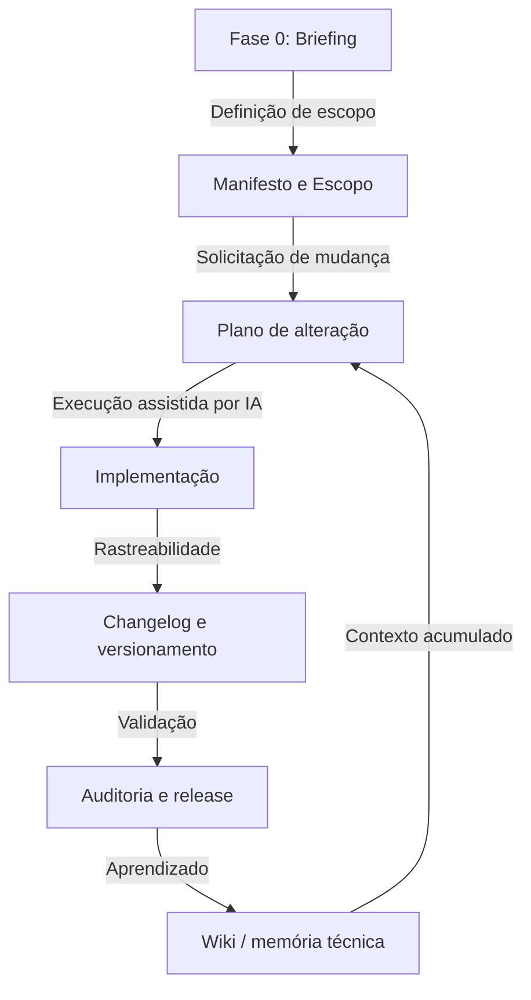

# FrameCode VibeWork Framework

**FrameCode VibeWork** é um framework de governança documental e técnica para desenvolvimento de aplicações assistido por IA. Ele reduz perda de contexto entre sessões ao combinar planos formais, changelogs, auditorias, troubleshooting, decisões arquiteturais, snippets reutilizáveis e uma LLM Wiki mantida em Markdown.

## Como Funciona

O framework usa um ciclo de vida explícito para garantir que mudanças sejam justificadas, planejadas, implementadas, validadas e registradas.



## Pilares

### 1. Governança por planos

Nenhuma alteração funcional, visual, estrutural ou documental deve ser aplicada sem plano correspondente em `Planos/`.

### 2. Rastreabilidade por versão

Toda alteração em arquivo versionado deve ser registrada em `changelogs/Vx.y.z.md`, com plano relacionado, arquivos afetados, validação e riscos residuais.

### 3. Memória técnica incremental

A pasta `wiki/` segue o padrão LLM Wiki: fontes brutas, páginas sintetizadas, índice, log, links internos, estados de confiança e lint periódico.

### 4. Snippets reutilizáveis

A pasta `snippets/` guarda componentes e padrões prontos para adaptação, com galeria visual e tokens CSS.

### 5. Separação entre framework e projeto

A pasta `governança/` preserva templates genéricos. Os documentos preenchidos do projeto ficam na raiz. A instanciação e as regras de renomeação estão em `INSTANCIACAO.md`.

## Estrutura De Diretórios

- `Planos/`: ciclo de vida das alterações.
- `changelogs/`: histórico formal por versão.
- `troubleshooting/`: registros de falhas, hipóteses e validações.
- `decisoes/`: ADRs formais.
- `auditorias/`: relatórios de auditoria.
- `briefings/`: registros de descoberta e Fase 0.
- `wiki/`: memória técnica compatível com Obsidian.
- `snippets/`: biblioteca de componentes e padrões reutilizáveis.
- `governança/`: templates genéricos do framework.

## Como Usar

### 1. Copiar ou clonar

Use este repositório como base para um novo projeto ou mantenha-o como framework central.

```bash
git clone https://github.com/Sistema2D/FrameCode-VibeWork.git meu-projeto
cd meu-projeto
```

### 2. Instanciar

Leia `AGENTS.md` e `INSTANCIACAO.md`. A instanciação não depende de script automático: renomeações e substituições devem ser feitas explicitamente, preservando templates em `governança/` e `wiki/templates/`.

### 3. Executar Fase 0

Preencha `BRIEFING.md`, atualize `MANIFESTO.md`, `STACK.md`, `ESCOPO.md` e `README.md`, e registre a alteração por plano e changelog.

### 4. Trabalhar com IA

Ao solicitar mudanças, peça para o agente seguir `AGENTS.md`. Para consultas, análise e revisão sem edição de arquivos, plano não é obrigatório. Para qualquer alteração, o fluxo de plano e changelog é obrigatório.

## Obsidian

Abra a pasta raiz como um vault no Obsidian para visualizar links entre decisões, falhas, padrões, auditorias, releases e sínteses da wiki.

## Créditos

O conceito de LLM Wiki usado como inspiração para a memória técnica incremental deste framework é creditado a Andrej Karpathy, autor do gist [LLM Wiki](https://gist.github.com/karpathy/442a6bf555914893e9891c11519de94f).

Se este framework for útil para o seu trabalho, você pode apoiar o desenvolvimento pelo Buy Me a Coffee:

<a href="https://www.buymeacoffee.com/hugomelovek"></a>

## Licença

Este projeto está licenciado sob a licença MIT. Veja `LICENSE`.
