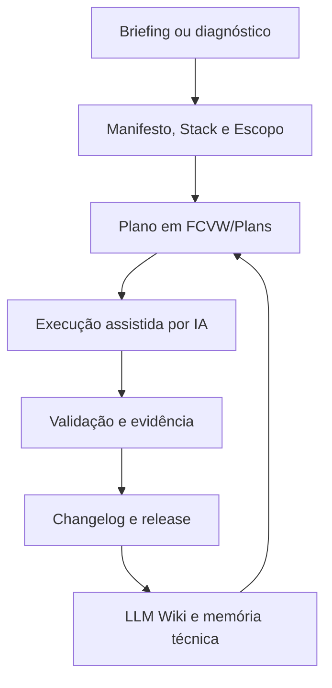
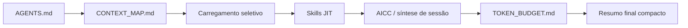
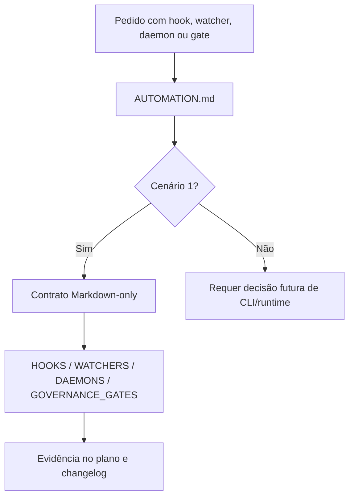
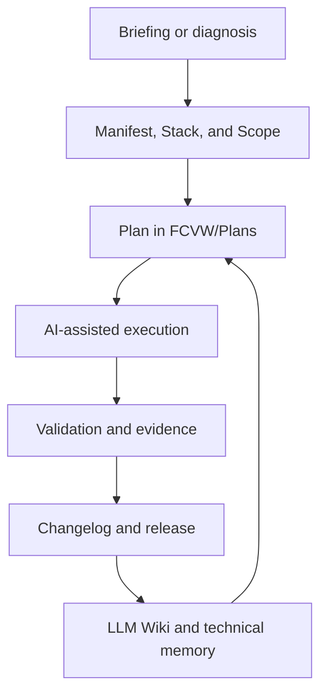
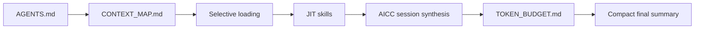
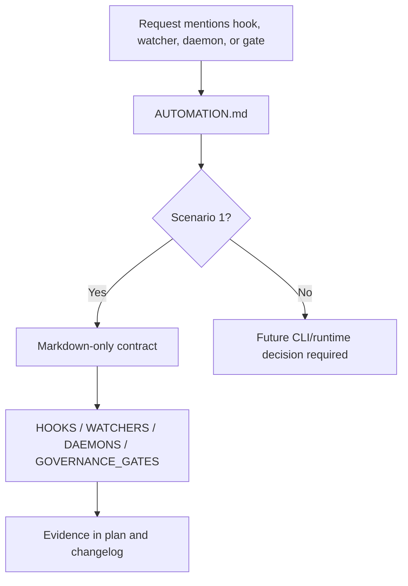

# FrameCode VibeWork Framework

Current framework version: `V0.12.0`

*Select Language / Selecione o Idioma:*
- [Português](#português)
- [English](#english)

---

## Português

**FrameCode VibeWork (FCVW)** é um framework de governança em Markdown para desenvolvimento de software assistido por IA. Ele organiza decisões, planos, changelogs, auditorias, troubleshooting, refatoração, memória técnica, skills sob demanda e contratos declarativos para que humanos e agentes de IA trabalhem com rastreabilidade.

O FCVW não é uma biblioteca de runtime. Ele é uma camada operacional que ensina o agente a **entender o projeto, planejar antes de alterar, validar antes de concluir e registrar conhecimento reutilizável**.

### O problema que o FCVW resolve

Em projetos com IA, é comum perder contexto entre sessões, repetir decisões, alterar arquivos sem plano, criar módulos grandes demais, esquecer changelog ou depender de prompts longos. O FCVW reduz esses riscos com uma estrutura versionada e auditável.

### Pipeline principal



### Pipeline de economia de tokens



### Pipeline de automação declarativa



### Pilares

1. **Governança por planos** — toda alteração versionada deve ter plano em `FCVW/Plans/`.
2. **Rastreabilidade por versão** — alterações entram em changelogs e releases.
3. **Memória técnica incremental** — a `FCVW/wiki/` registra padrões, decisões, falhas e sínteses.
4. **Skills sob demanda** — `FCVW/skills/` reduz contexto inicial e carrega checklists apenas quando necessário.
5. **Controle de saída** — `FCVW/TOKEN_BUDGET.md` orienta respostas compactas e mantém evidências detalhadas nos artefatos do repositório.
6. **Automação declarativa** — hooks, watchers, daemons e gates são contratos Markdown-only no cenário 1.
7. **Refatoração governada** — o framework bloqueia monólitos, duplicação e limpeza sem escopo.
8. **Instanciação nova e retroativa** — o FCVW pode ser usado em projetos novos ou adotado em aplicações existentes.

### Estrutura essencial

| Caminho | Função |
|---|---|
| `AGENTS.md` | Entrada operacional para humanos e agentes |
| `FCVW/CONTEXT_MAP.md` | Mapa de carregamento seletivo por tipo de sessão |
| `FCVW/PLANNING.md` | Metodologia de planos, prioridade e risco |
| `FCVW/TOKEN_BUDGET.md` | Política de economia de tokens de saída |
| `FCVW/AUTOMATION.md` | Limite dos contratos declarativos Markdown-only |
| `FCVW/HOOKS.md` | Pseudo-hooks em checklist |
| `FCVW/WATCHERS.md` | Regras evento/reação sem watcher real |
| `FCVW/DAEMONS.md` | Loops manuais/agentic sem processo em background |
| `FCVW/GOVERNANCE_GATES.md` | Mapa de gates, evidências e bloqueios |
| `FCVW/wiki/` | LLM Wiki, memória técnica e sínteses AICC |
| `FCVW/skills/` | Skills carregadas sob demanda |
| `FCVW/FILESYSTEM.md` | Fonte de verdade da árvore física |

### Como usar

```bash
git clone https://github.com/Sistema2D/FrameCode-VibeWork.git meu-projeto
cd meu-projeto
```

1. Leia `AGENTS.md`.
2. Consulte `FCVW/CONTEXT_MAP.md` para carregar apenas os documentos necessários.
3. Use `FCVW/BRIEFING.md` e `FCVW/INSTANTIATION.md` em projetos novos.
4. Use `FCVW/RETROACTIVE_INSTANTIATION.md` em projetos já existentes.
5. Crie ou atualize planos antes de qualquer alteração versionada.
6. Registre changelog, validação e memória técnica ao concluir.

---

## English

**FrameCode VibeWork (FCVW)** is a Markdown governance framework for AI-assisted software development. It organizes decisions, plans, changelogs, audits, troubleshooting, refactoring, technical memory, on-demand skills, and declarative contracts so humans and AI agents can work with traceability.

FCVW is not a runtime library. It is an operational layer that teaches the agent to **understand the project, plan before changing, validate before closing, and record reusable knowledge**.

### The problem FCVW solves

AI-assisted projects often lose context between sessions, repeat decisions, change files without plans, create oversized modules, forget changelogs, or depend on long prompts. FCVW reduces those risks with a versioned and auditable structure.

### Main pipeline



### Token economy pipeline



### Declarative automation pipeline



### Pillars

1. **Plan-based governance** — every versioned change needs a plan in `FCVW/Plans/`.
2. **Version traceability** — changes are recorded in changelogs and releases.
3. **Incremental technical memory** — `FCVW/wiki/` stores patterns, decisions, failures, and session syntheses.
4. **On-demand skills** — `FCVW/skills/` lowers initial context and loads specialized checklists only when needed.
5. **Output budget** — `FCVW/TOKEN_BUDGET.md` favors compact summaries while detailed evidence stays in repository artifacts.
6. **Declarative automation** — hooks, watchers, daemons, and gates are Markdown-only contracts in Scenario 1.
7. **Governed refactoring** — the framework blocks monoliths, duplication, and cleanup without scope.
8. **New and retroactive adoption** — FCVW can bootstrap new projects or be adopted by existing applications.

### Essential structure

| Path | Role |
|---|---|
| `AGENTS.md` | Operational entry point for humans and agents |
| `FCVW/CONTEXT_MAP.md` | Selective context loading map by session type |
| `FCVW/PLANNING.md` | Plan, priority, and risk methodology |
| `FCVW/TOKEN_BUDGET.md` | Output-token economy policy |
| `FCVW/AUTOMATION.md` | Markdown-only declarative automation boundary |
| `FCVW/HOOKS.md` | Pseudo-hook checklists |
| `FCVW/WATCHERS.md` | Event/reaction rules without real watchers |
| `FCVW/DAEMONS.md` | Manual/agentic loops without background processes |
| `FCVW/GOVERNANCE_GATES.md` | Gate, evidence, and blocking-condition map |
| `FCVW/wiki/` | LLM Wiki, technical memory, and AICC syntheses |
| `FCVW/skills/` | On-demand AI skills |
| `FCVW/FILESYSTEM.md` | Source of truth for the physical tree |

### How to use

```bash
git clone https://github.com/Sistema2D/FrameCode-VibeWork.git my-project
cd my-project
```

1. Read `AGENTS.md`.
2. Use `FCVW/CONTEXT_MAP.md` to load only the necessary documents.
3. Use `FCVW/BRIEFING.md` and `FCVW/INSTANTIATION.md` for new projects.
4. Use `FCVW/RETROACTIVE_INSTANTIATION.md` for existing projects.
5. Create or update plans before any versioned change.
6. Record changelog, validation, and technical memory before closing.
