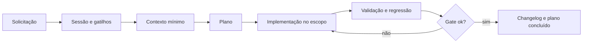
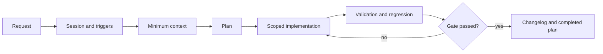

<a id="top"></a>

<div align="center">

# FrameCode VibeWork

**Markdown-First Declarative Governance for AI-Assisted Software Development**

Scoped planning · regression protection · selective context · controlled technical memory

[](https://buymeacoffee.com/hugomelovek)
[](LICENSE)
[](https://www.linkedin.com/in/hugoaraujo92/)
[](https://github.com/Sistema2D/FrameCode-VibeWork/releases/tag/v0.19.0)

Stable release **V0.19.0**

[](#pt-br)
[](#en-us)

</div>

---

<a id="pt-br"></a>

## Português (Brasil) · PT-BR

[Visão geral](#pt-visao-geral) · [Como começar](#pt-comecar) · [Fluxo de uma mudança](#pt-fluxo) · [Validação](#pt-validacao) · [Mapa](#pt-mapa) · [Versões](#pt-versoes) · [English (US)](#en-us)

<a id="pt-visao-geral"></a>

### Visão geral

FrameCode VibeWork (FCVW) é uma camada portátil de governança em Markdown para projetos desenvolvidos por pessoas e agentes de IA. Uma solicitação vira uma cadeia verificável: contexto mínimo, plano, execução no escopo, evidência, registro de versão e conhecimento reutilizável.

Ele ataca problemas recorrentes do desenvolvimento assistido: mudanças sem escopo ou rollback, agentes que leem pouco contexto (ou o repositório inteiro), conclusão sem prova de não regressão, políticas do framework misturadas com dados do projeto, memória de sessões sem curadoria e automações alegadas sem gatilho, permissão ou evidência.

Os documentos Markdown são a fonte normativa. As ferramentas em Python (3.10 ou mais recente, só biblioteca padrão) são opcionais e automatizam as invariantes determinísticas.

**Princípios:** escopo antes da mutação; contexto seletivo; evidência antes da conclusão; novo comportamento **e** preservação do que já funcionava; ownership explícito; histórico não é política atual; automação só com contrato observável; nenhuma autoridade presumida para commit, tag, publicação ou ação destrutiva.

| Papel | Representa | Atualização |
|---|---|---|
| `framework_policy` | regra genérica do FCVW | substituída no upgrade, com migração quando preciso |
| `framework_lock` | baseline instalada ([FRAMEWORK_LOCK.md](FCVW/FRAMEWORK_LOCK.md)) | mudança governada |
| `project_profile` | verdade da aplicação ([PROJECT.md](FCVW/PROJECT.md), segurança, dados, regras) | preenchida e preservada |
| `record` | evidência histórica: planos, changelogs, ADRs, falhas | preservada, nunca sobrescrita em lote |
| `template` | modelo vazio em `FCVW/governance/` | substituído quando compatível |

Contratos completos em [OWNERSHIP.md](FCVW/OWNERSHIP.md) e [SCHEMAS.md](FCVW/SCHEMAS.md).

<a id="pt-comecar"></a>

### Como começar

- **Projeto novo:** leia [AGENTS.md](AGENTS.md), classifique a sessão no [CONTEXT_MAP.md](FCVW/CONTEXT_MAP.md) e siga [INSTANTIATION.md](FCVW/INSTANTIATION.md). Preencha o [PROJECT.md](FCVW/PROJECT.md) só com fatos aprovados; seções que não se aplicam vão para `not_applicable_sections`. Crie o primeiro plano em `FCVW/Plans/pending/` e valide com `--profile instantiated`.
- **Aplicação existente:** use o [modo retroativo](FCVW/INSTANTIATION.md#retroactive-instantiation). Ele inventaria o projeto e preserva código e histórico; adotar o FCVW não autoriza refatoração.
- **Upgrade:** rode `upgrade_fcvw.py` da nova release em modo de simulação e siga o [MIGRATIONS.md](FCVW/MIGRATIONS.md). Profiles e registros do projeto são sempre preservados.
- **Manter o próprio FCVW:** planos com `record_scope: framework`, registros em `FCVW/framework-releases/` e validação `clean-template`. O backlog está em [TODO.md](TODO.md).

<a id="pt-fluxo"></a>

### Fluxo de uma mudança


```mermaid
flowchart LR
    A["Solicitação"] --> B["Sessão e gatilhos"]
    B --> C["Contexto mínimo"]
    C --> D["Plano"]
    D --> E["Implementação no escopo"]
    E --> F["Validação e regressão"]
    F --> G{"Gate ok?"}
    G -- "não" --> E
    G -- "sim" --> H["Changelog e plano concluído"]
```

1. Procure trabalho relacionado em `Plans/in_progress/` e `pending/`.
2. Crie ou retome um plano com objetivo, limites, risco, critérios de aceite, impacto de regressão e rollback. Mudanças P4/P5 com R1 usam o plano compacto.
3. Mova o plano para `in_progress/` e altere só o que está no escopo.
4. Colete evidência proporcional ao risco e registre a mudança em `changelogs/` (aplicação) ou `framework-releases/` (FCVW).
5. Conclua o plano quando não houver resultado de regressão pendente.

Consultas, análises e revisões não exigem plano. A correção de um erro de digitação em prosa também não: sem mexer em frontmatter, links, tabelas, código ou políticas, basta um commit convencional (ver [PLANNING.md](FCVW/PLANNING.md)).

A leitura obrigatória vem do [CONTEXT_MAP.md](FCVW/CONTEXT_MAP.md): tipo de sessão, `context_files` do plano ativo e eventos declarados (segurança, dados, interface pública, IA, automação, release). O caminho de um arquivo só indica fatos inequívocos, como uma adição ou uma política do framework. O impacto semântico em arquivos da aplicação é declarado por quem faz a mudança, e a ferramenta avisa quando nenhum evento foi declarado.

<a id="pt-validacao"></a>

### Validação

No checkout-fonte as ferramentas ficam em `tools/`; numa instalação, em `FCVW/tools/`.

```sh
python tools/check_fcvw.py                                         # testes, governança, benchmark e smoke de instalação
python tools/validate_fcvw.py --root . --profile clean-template     # template limpo
python tools/validate_fcvw.py --root . --profile instantiated       # projeto instanciado
python tools/plan_queue_fcvw.py --root . --recommend                # próximo plano
python tools/retrieve_context.py --root . --session feature --event security   # leituras obrigatórias
```

O perfil `incremental` aceita uma baseline de débito legado revisada; `strict` trata todo finding como bloqueante. O validador cobre caminhos, metadados, links, planos, regressões, skills, rotas de leitura, wiki, ADRs, ownership e versões. Ele não substitui os testes da aplicação nem a revisão humana de alto risco.

<a id="pt-mapa"></a>

### Mapa do repositório

| Caminho | Responsabilidade |
|---|---|
| [AGENTS.md](AGENTS.md) | ordem de operação, mudanças, leitura e encerramento |
| `.cursorrules`, `.windsurfrules` | pontes legadas que apontam para o `AGENTS.md` |
| [FCVW/README.md](FCVW/README.md) | índice canônico do framework |
| [FCVW/CONTEXT_MAP.md](FCVW/CONTEXT_MAP.md) | rotas por sessão, evento e seção |
| [FCVW/PLANNING.md](FCVW/PLANNING.md), [REGRESSION_GUARDS.md](FCVW/REGRESSION_GUARDS.md), [TESTS.md](FCVW/TESTS.md) | planos, preservação e evidência |
| [FCVW/PROJECT.md](FCVW/PROJECT.md) | perfil único do projeto |
| `FCVW/Plans/`, `changelogs/`, `framework-releases/`, `decisions/` | registros |
| `FCVW/governance/` | templates |
| `FCVW/wiki/` | memória técnica ([contrato](FCVW/wiki/README.md)) |
| `FCVW/skills/` | 18 procedimentos sob demanda ([catálogo](FCVW/skills/README.md)) |
| `tools/` | ferramentas opcionais e seus testes |

<a id="pt-versoes"></a>

### Versões e limites

Aplicação e framework têm versões separadas: `FCVW/changelogs/` e a fonte de versão do produto, contra `FCVW/framework-releases/` e o `FRAMEWORK_LOCK.md`. Cada release publica quatro templates monolíngues independentes (`pt-BR`, `en-US`, `es`, `de`); o idioma é escolhido no download. O pacote instalado contém só `AGENTS.md`, `FCVW/` e as pontes opcionais; remover o framework é apagar `FCVW/` depois de preservar os registros do projeto. As novidades de cada versão estão nos [release records](https://github.com/Sistema2D/FrameCode-VibeWork/tree/main/FCVW/framework-releases).

O FCVW não é runtime de agente, IDE, banco de dados nem substituto de testes, CI ou revisão humana, e não autoriza por si só mudanças em sistemas externos.

[English (US)](#en-us) · [Topo](#top)

---

<a id="en-us"></a>

## English (United States) · ENG-US

[Overview](#en-overview) · [Getting started](#en-getting-started) · [Change lifecycle](#en-lifecycle) · [Validation](#en-validation) · [Map](#en-map) · [Versions](#en-versions) · [Português (Brasil)](#pt-br)

<a id="en-overview"></a>

### Overview

FrameCode VibeWork (FCVW) is a portable Markdown governance layer for projects developed by people and AI agents. A request becomes a verifiable chain: minimum context, plan, scoped execution, evidence, version record and reusable knowledge.

It targets recurring problems of AI-assisted development: changes without scope or rollback, agents reading too little context (or the whole repository), completion without regression evidence, framework policy mixed with project data, uncurated session memory, and claimed automation without trigger, permission or evidence.

Markdown documents are normative. The Python tools (3.10 or later, standard library only) are optional and automate the deterministic invariants.

**Principles:** scope before mutation; selective context; evidence before completion; new behavior **and** preservation of what already worked; explicit ownership; history is not current policy; automation only with an observable contract; no presumed authority for commits, tags, publication or destructive actions.

| Role | Represents | Update rule |
|---|---|---|
| `framework_policy` | generic FCVW rule | replaced on upgrade, with a migration when needed |
| `framework_lock` | installed baseline ([FRAMEWORK_LOCK.md](FCVW/FRAMEWORK_LOCK.md)) | governed change |
| `project_profile` | application truth ([PROJECT.md](FCVW/PROJECT.md), security, data, rules) | populated and preserved |
| `record` | historical evidence: plans, changelogs, ADRs, failures | preserved, never bulk-overwritten |
| `template` | empty model in `FCVW/governance/` | replaced when compatible |

Complete contracts are in [OWNERSHIP.md](FCVW/OWNERSHIP.md) and [SCHEMAS.md](FCVW/SCHEMAS.md).

<a id="en-getting-started"></a>

### Getting started

- **New project:** read [AGENTS.md](AGENTS.md), classify the session in [CONTEXT_MAP.md](FCVW/CONTEXT_MAP.md) and follow [INSTANTIATION.md](FCVW/INSTANTIATION.md). Fill [PROJECT.md](FCVW/PROJECT.md) with approved facts only; sections that do not apply go into `not_applicable_sections`. Create the first plan under `FCVW/Plans/pending/` and validate with `--profile instantiated`.
- **Existing application:** use the [retroactive mode](FCVW/INSTANTIATION.md#retroactive-instantiation). It inventories the project and preserves code and history; adopting FCVW does not authorize refactoring.
- **Upgrade:** run the new release's `upgrade_fcvw.py` as a dry run and follow [MIGRATIONS.md](FCVW/MIGRATIONS.md). Project profiles and records are always preserved.
- **Maintaining FCVW itself:** plans with `record_scope: framework`, records under `FCVW/framework-releases/` and `clean-template` validation. The backlog is [TODO.md](TODO.md).

<a id="en-lifecycle"></a>

### Change lifecycle


```mermaid
flowchart LR
    A["Request"] --> B["Session and triggers"]
    B --> C["Minimum context"]
    C --> D["Plan"]
    D --> E["Scoped implementation"]
    E --> F["Validation and regression"]
    F --> G{"Gate passed?"}
    G -- "no" --> E
    G -- "yes" --> H["Changelog and completed plan"]
```

1. Look for related work in `Plans/in_progress/` and `pending/`.
2. Create or resume a plan with objective, limits, risk, acceptance criteria, regression impact and rollback. P4/P5 changes with R1 use the compact plan.
3. Move the plan to `in_progress/` and change only what is in scope.
4. Collect evidence proportional to risk and record the change in `changelogs/` (application) or `framework-releases/` (FCVW).
5. Complete the plan when no regression result is pending.

Queries, analyses and reviews need no plan. Neither does a typo fix in prose: without touching frontmatter, links, tables, code or policies, a conventional commit is enough (see [PLANNING.md](FCVW/PLANNING.md)).

Mandatory reading comes from [CONTEXT_MAP.md](FCVW/CONTEXT_MAP.md): session type, the active plan's `context_files` and declared events (security, data, public interface, AI, automation, release). A file path only implies unambiguous facts, such as an addition or a framework policy. Semantic impact on application files is declared by whoever makes the change, and the tool warns when none was declared.

<a id="en-validation"></a>

### Validation

Tools live in `tools/` in the source checkout and in `FCVW/tools/` when installed.

```sh
python tools/check_fcvw.py                                         # tests, governance, benchmark, installed smoke
python tools/validate_fcvw.py --root . --profile clean-template     # clean template
python tools/validate_fcvw.py --root . --profile instantiated       # instantiated project
python tools/plan_queue_fcvw.py --root . --recommend                # next plan
python tools/retrieve_context.py --root . --session feature --event security   # mandatory reads
```

The `incremental` profile accepts a reviewed legacy-debt baseline; `strict` treats every finding as blocking. The validator covers paths, metadata, links, plans, regressions, skills, reading routes, wiki, ADRs, ownership and versions. It does not replace application tests or high-risk human review.

<a id="en-map"></a>

### Repository map

| Path | Responsibility |
|---|---|
| [AGENTS.md](AGENTS.md) | operating order, changes, reading and closeout |
| `.cursorrules`, `.windsurfrules` | legacy bridges pointing to `AGENTS.md` |
| [FCVW/README.md](FCVW/README.md) | canonical framework index |
| [FCVW/CONTEXT_MAP.md](FCVW/CONTEXT_MAP.md) | session, event and section routes |
| [FCVW/PLANNING.md](FCVW/PLANNING.md), [REGRESSION_GUARDS.md](FCVW/REGRESSION_GUARDS.md), [TESTS.md](FCVW/TESTS.md) | plans, preservation and evidence |
| [FCVW/PROJECT.md](FCVW/PROJECT.md) | single project profile |
| `FCVW/Plans/`, `changelogs/`, `framework-releases/`, `decisions/` | records |
| `FCVW/governance/` | templates |
| `FCVW/wiki/` | technical memory ([contract](FCVW/wiki/README.md)) |
| `FCVW/skills/` | 18 on-demand procedures ([catalog](FCVW/skills/README.md)) |
| `tools/` | optional tools and their tests |

<a id="en-versions"></a>

### Versions and limits

Application and framework versions are separate: `FCVW/changelogs/` and the product version source, versus `FCVW/framework-releases/` and `FRAMEWORK_LOCK.md`. Each release publishes four independent monolingual templates (`pt-BR`, `en-US`, `es`, `de`); the language is chosen at download. The installed package contains only `AGENTS.md`, `FCVW/` and the optional bridges; removing the framework means deleting `FCVW/` after preserving the project's records. What changed in each version is in the [release records](https://github.com/Sistema2D/FrameCode-VibeWork/tree/main/FCVW/framework-releases).

FCVW is not an agent runtime, IDE, database or substitute for tests, CI or human review, and it does not by itself authorize changes to external systems.

[Português (Brasil)](#pt-br) · [Top](#top)

---

<div align="center">

Stable: [V0.19.0](https://github.com/Sistema2D/FrameCode-VibeWork/releases/tag/v0.19.0) · [Technical release record](FCVW/framework-releases/V0.19.0.md)

[Apache License 2.0](LICENSE) · [Attribution / Atribuição](NOTICE) · [LinkedIn](https://www.linkedin.com/in/hugoaraujo92/) · [Buy Me a Coffee](https://buymeacoffee.com/hugomelovek)

</div>
