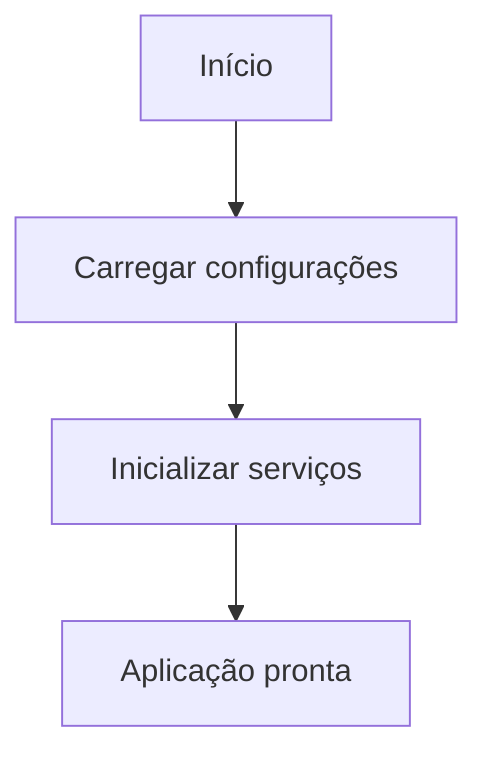
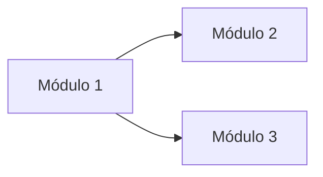
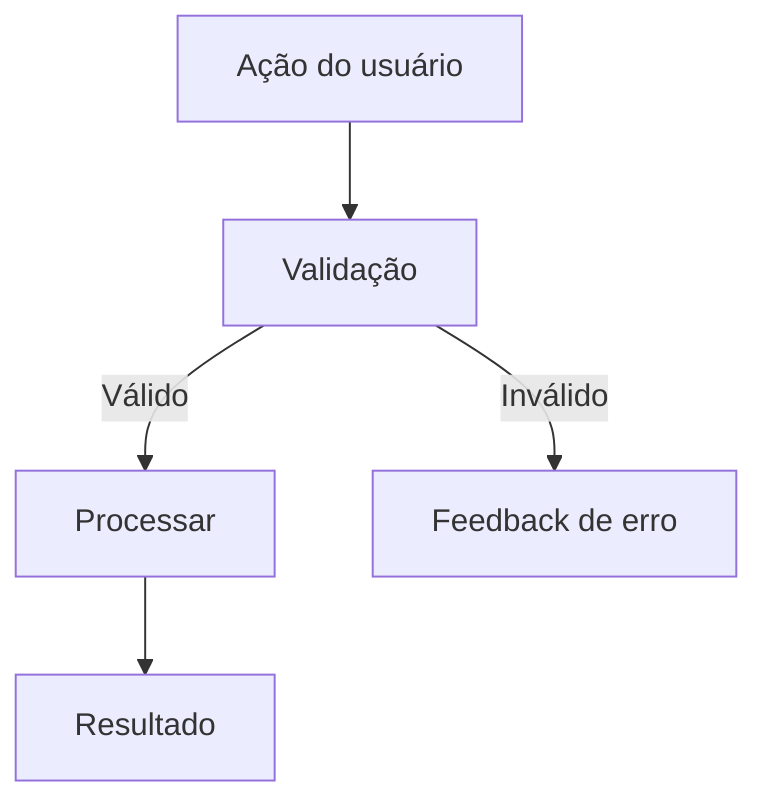
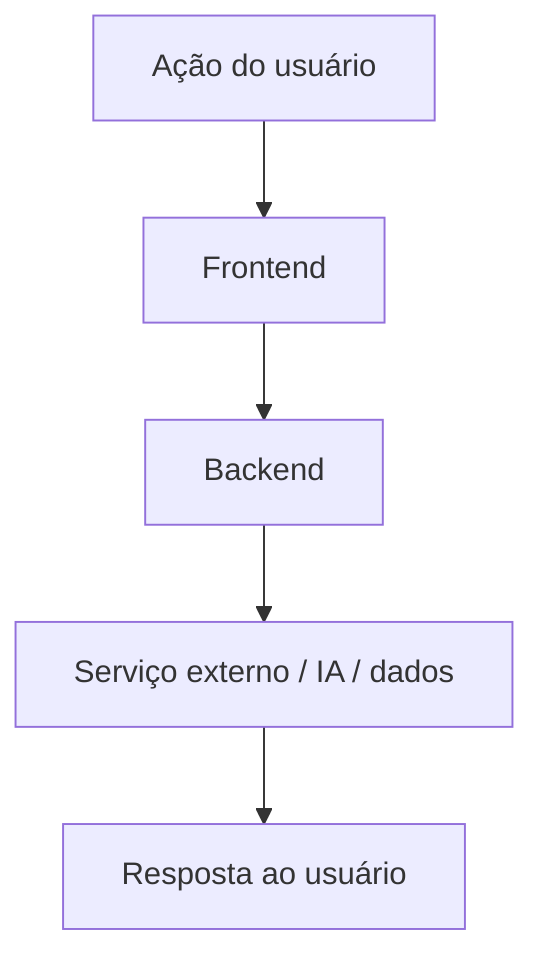
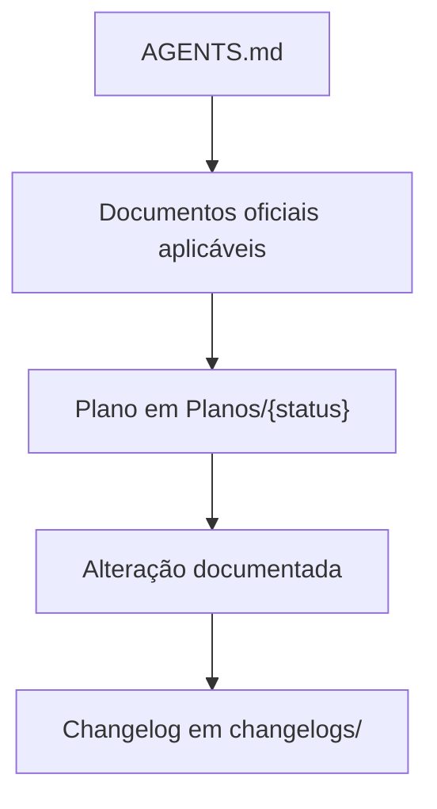

# WORKFLOW.md

Documento operacional detalhado da aplicação.

> Este é um modelo. Adapte as seções conforme a arquitetura real do projeto. Remova ou substitua módulos que não existirem.

Este arquivo descreve o comportamento funcional de cada módulo/tela/serviço da aplicação com foco em:

- conceito e objetivo de cada área;
- controles e componentes (botões, campos, listas, modais, toggles, sliders);
- eventos de usuário e efeitos no estado da aplicação;
- integração entre camadas (frontend, backend, serviços externos);
- persistência local e fluxos de processamento;
- fluxogramas Mermaid dos principais caminhos.

## 1. Visão geral da arquitetura de runtime

### 1.1 `<Camada 1 — ex: Frontend>`

`<Descreva o processo principal, responsabilidades e estado em memória.>`

### 1.2 `<Camada 2 — ex: Backend>`

`<Descreva o serviço local/remoto, endpoints e integrações.>`

### 1.3 Persistência local

`<Descreva os arquivos de configuração, dados do usuário e vault.>`

## 2. Ciclo de vida da aplicação

### 2.1 Inicialização

`<Descreva os passos de boot: carregamento de configurações, criação de controles, conexão com serviços.>`

### 2.2 Encerramento

`<Descreva os passos de shutdown: salvar estado, fechar conexões, liberar recursos.>`

## 3. Navegação global

`<Descreva como o usuário navega entre telas ou módulos.>`

## 4. Módulo `<Nome do módulo 1>`

### 4.1 Conceito e objetivo

`<Descreva o propósito do módulo.>`

### 4.2 Componentes

`<Liste controles, campos e elementos visuais relevantes.>`

### 4.3 Fluxo principal

`<Descreva o fluxo passo a passo.>`

## 5. Módulo `<Nome do módulo 2>`

### 5.1 Conceito e objetivo

`<Descreva o propósito do módulo.>`

### 5.2 Componentes

`<Liste controles, campos e elementos visuais relevantes.>`

### 5.3 Fluxo principal

`<Descreva o fluxo passo a passo.>`

## 6. Backend / Serviço local

`<Remover se não houver backend separado.>`

### 6.1 Segurança e middleware

`<Descreva token, CORS e autenticação.>`

### 6.2 Endpoints principais

`<Liste os endpoints com método, rota e finalidade.>`

| Método | Rota | Finalidade |
|---|---|---|
| GET | `/health` | Healthcheck |
| `<método>` | `<rota>` | `<descrição>` |

## 7. Fluxo integrado

`<Descreva o fluxo que conecta todas as camadas para o caso de uso principal.>`

## 8. Atalhos e comportamentos transversais

`<Liste atalhos de teclado, gestos ou comportamentos que se aplicam a múltiplos módulos.>`

## 9. Workflow de governança documental

O framework FrameCode VibeWork possui um fluxo operacional próprio, separado do runtime da aplicação.

1. `AGENTS.md` orienta a consulta inicial e aponta para os documentos oficiais aplicáveis.
2. `PLANEJAMENTO.md` define a metodologia e cada mudança é registrada em `Planos/{status}`.
3. A implementação ou alteração documental atualiza os documentos oficiais afetados.
4. `VERSIONAMENTO.md` orienta a versão prevista e o changelog correspondente em `changelogs/`.

## 10. Observações de manutenção

`<Registre aqui riscos de manutenção conhecidos, dependências críticas e áreas que exigem atenção especial ao fazer mudanças.>`

- Ao evoluir comportamento descrito aqui, manter este documento sincronizado no mesmo plano/changelog da mudança.
