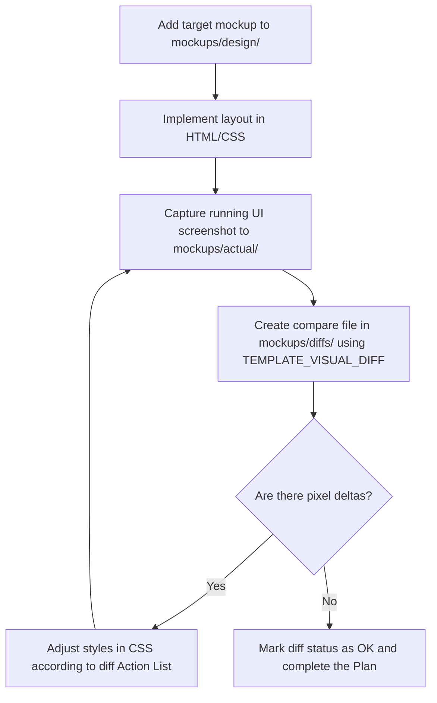

# Visual Mockups & Pixel-Perfect Governance

This directory serves as the **Visual Single Source of Truth (VSOT)** for the application under development. Its goal is to eliminate visual drift between the planned layouts (mockups) and the actual running user interface (code).

---

## 1. Directory Structure

```text
[project-root]/mockups/
├── README.md               # This calibration guide
├── design/                 # Conceptual prints, mockups, or wireframes (e.g. from Figma)
├── actual/                 # Physical screenshots captured from the running UI
└── diffs/                  # Comparative markdown files calculating pixel discrepancies
```

---

## 2. Interface Mapping Calibration

To ensure precise, consistent pixel measurements, follow these standards when comparing mockups and actual screenshots:

### A. Screen Resolutions
* All screenshots must be captured at standard display settings (recommended: `1920x1080` screen resolution, `100%` OS display scaling zoom).
* Ensure browser window zoom is set to `100%` when capturing actual web application screens.

### B. Defining Bounding Boxes
When describing elements in the comparative markdown files, use CSS coordinate models:
* `Position:` `Top`, `Left`, `Right`, `Bottom` coordinates relative to their container.
* `Sizing:` `Width` (W) and `Height` (H) in pixels.
* `Format:` `[Element Name] { Top: Ypx, Left: Xpx, W: Wpx, H: Hpx }`

### C. Reference Tokens
Cross-reference margins, paddings, and font sizes against the design tokens defined in [DESIGN.md](file:///c:/Users/Hugo/Desktop/FCVW/DESIGN.md) (e.g., `space-md = 16px`, `space-lg = 24px`) to identify whether discrepancies are caused by incorrect token values or ad-hoc style overrides.

---

## 3. Pixel-Perfect Synchronization Workflow

Whenever a screen is created, modified, or updated in the UI, execute this lifecycle:



### Self-Healing & Deletion
* When a screen module is discontinued in [SCOPE.md](file:///c:/Users/Hugo/Desktop/FCVW/SCOPE.md), delete the associated mockups inside `/design/` and `/actual/`, and move the comparative file to the discontinued history or delete it.
* Run the filesystem synchronization script `governance/scripts/sync-filesystem.ps1` to update `FILESYSTEM.md` tree.
